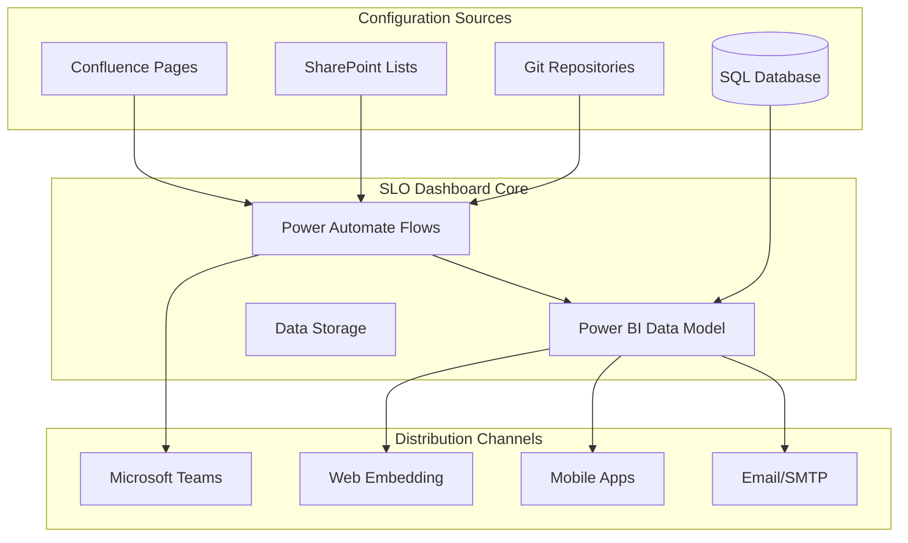

# Integration Setup Guide

## Integration Architecture

The SLO Dashboard system integrates with multiple Microsoft 365 and third-party systems to provide seamless configuration management, automated distribution, and comprehensive monitoring capabilities.

### Core Integration Points



### Integration Data Flow

1. **Source Systems**: Jira, Confluence, Git repositories provide raw data and configuration
2. **Orchestration Layer**: Power Automate manages data synchronization and transformations
3. **Data Processing**: Power BI processes tickets and applies configured business rules
4. **Distribution Layer**: Multiple channels deliver insights and alerts to stakeholders

---

## Database Integration

### Jira Data Connection

**SQL Server Connection Setup**
```yaml
DATABASE_CONFIG:
  server: "sql-server.company.com"
  database: "jira_datawarehouse"
  authentication: "integrated_security"
  connection_timeout: 30
  command_timeout: 300
```

**Key Tables and Refresh Strategy**:
- **jira_snapshot**: Current ticket state (nightly full refresh)
- **jira_changelog**: Status change history (incremental refresh)
- **Refresh Schedule**: 2:00 AM UTC daily with retry logic

**Connection Security**:
- Service account with read-only permissions
- Encrypted connections (TLS 1.2 minimum)
- IP whitelisting for Power BI service
- Connection monitoring and automatic failover

---

## Confluence Integration

### Configuration Synchronization

**REST API Configuration**
```json
{
  "confluence_api": {
    "base_url": "https://company.atlassian.net/wiki",
    "auth_type": "api_token",
    "service_account": "slo-dashboard@company.com",
    "sync_schedule": "nightly_02:00_UTC",
    "page_space": "SLO",
    "monitored_pages": [
      "Data-Quality-Configuration",
      "Data-Extracts-Configuration", 
      "Change-Controls-Configuration",
      "Reference-Data-Configuration",
      "Records-Management-Configuration"
    ]
  }
}
```

**Synchronization Process**:
1. **Change Detection**: Query Confluence API for page modifications since last sync
2. **Content Extraction**: Parse structured tables from modified pages
3. **Validation**: Apply business rules and data quality checks
4. **Transformation**: Convert to Power BI configuration format
5. **Loading**: Update Power BI data model with new configurations
6. **Verification**: Validate successful sync and notify stakeholders

**Page Structure Requirements**:
- Standardized table headers for SLO targets, issue mappings, status rules
- Metadata tracking (last modified, version, approver)
- Change comments explaining business justification

### Change Tracking Integration

**Audit Trail Features**:
- Real-time change detection via webhook subscriptions
- Complete version history with before/after comparisons
- User attribution for all modifications
- Rollback capabilities to previous configurations

---

## Git Integration

### Version Control Setup

**Repository Configuration**
```yaml
GIT_INTEGRATION:
  repository_url: "https://github.com/company/slo-dashboard-config.git"
  branch: "main"
  sync_path: "/capabilities/"
  auth_method: "personal_access_token"
  webhook_secret: "[WEBHOOK_SECRET]"
```

**File Structure**:
```
/capabilities/
├── data-quality/
│   ├── slo-targets.yml
│   ├── issue-mappings.yml
│   └── status-rules.yml
├── data-extracts/
│   └── [similar structure]
└── global/
    ├── default-sla.yml
    └── system-settings.yml
```

**Integration Features**:
- **Automated Sync**: Webhook triggers immediate sync on repository changes
- **Pull Request Integration**: Configuration changes via PR approval process
- **Conflict Resolution**: Merge conflict detection and resolution procedures
- **Branch Protection**: Main branch protection with required reviews

---

## Power Automate Integration

### Workflow Orchestration

**Core Flows**:
1. **Configuration Sync Flow**: Confluence → Power BI synchronization
2. **Alert Distribution Flow**: SLO breach → Multi-channel notifications  
3. **Report Generation Flow**: Automated monthly report creation and distribution
4. **Data Quality Flow**: Validation and error handling for incoming data

**Example Flow Configuration**:
```json
{
  "flow_name": "SLO_Configuration_Sync",
  "trigger": {
    "type": "recurrence",
    "frequency": "day",
    "time": "02:00"
  },
  "actions": [
    {
      "confluence_api_call": "get_recent_changes",
      "parameters": {"space": "SLO", "limit": 100}
    },
    {
      "condition": "changes_detected",
      "true_actions": ["extract_config", "validate_config", "update_powerbi"],
      "false_actions": ["log_no_changes"]
    }
  ]
}
```

**Error Handling and Retry Logic**:
- Automatic retry with exponential backoff
- Dead letter queue for failed operations
- Administrator notifications for persistent failures
- Manual intervention triggers for complex issues

---

## Email and Teams Integration

### SMTP Configuration

**Email Service Setup**
```yaml
EMAIL_CONFIG:
  smtp_server: "smtp.office365.com"
  port: 587
  encryption: "STARTTLS"
  authentication:
    method: "OAuth2"
    tenant_id: "[AZURE_TENANT_ID]"
    client_id: "[EMAIL_APP_ID]"
    certificate_thumbprint: "[CERT_THUMBPRINT]"
```

**Distribution Features**:
- **Monthly Reports**: Automated capability performance summaries
- **Alert Notifications**: Real-time SLO breach and risk alerts
- **Custom Templates**: HTML email templates with embedded charts and metrics
- **Delivery Tracking**: Read receipts, bounce handling, and engagement analytics

### Microsoft Teams Integration

**Teams App Registration**
```json
{
  "teams_app": {
    "app_id": "[TEAMS_APP_ID]",
    "bot_id": "[BOT_ID]",
    "permissions": [
      "ChannelMessage.Send",
      "Chat.ReadWrite",
      "TeamsAppInstallation.ReadWriteForUser"
    ],
    "scopes": ["team", "personal"],
    "webhook_url": "https://company.webhook.office.com/webhookb2/[WEBHOOK-ID]"
  }
}
```

**Integration Capabilities**:
- **Channel Notifications**: Capability-specific alerts to designated Team channels
- **Interactive Cards**: Actionable notifications with direct dashboard links
- **Bot Commands**: `/slo status [capability]` for immediate SLO queries
- **Workflow Integration**: Approval workflows within Teams channels

---

## SharePoint Integration

### Dashboard Embedding

**Power BI Web Part Configuration**
```javascript
// SharePoint Framework web part settings
const embedConfig = {
  type: "report",
  id: "[REPORT_ID]",
  groupId: "[WORKSPACE_ID]",
  embedUrl: "https://app.powerbi.com/reportEmbed",
  accessToken: "[ACCESS_TOKEN]",
  settings: {
    filterPaneEnabled: true,
    navContentPaneEnabled: false,
    layoutType: "FitToWidth",
    customLayout: {
      displayOption: "FitToPage"
    }
  }
};
```

**Embedding Locations**:
- **Executive Portal**: `/sites/executive/SitePages/SLO-Overview.aspx`
- **Capability Sites**: `/sites/[capability]/SitePages/Performance-Dashboard.aspx`
- **Team Sites**: Embedded in capability team collaboration spaces
- **Personal Dashboards**: My Sites integration with personalized views

### Document and Configuration Management

**SharePoint List Integration**:
- **User Preferences**: Subscription settings, alert configurations
- **Capability Registry**: Master list of all organizational capabilities
- **Access Management**: Permission groups and security configurations

---

## API Integration

### Power BI REST API Setup

**Authentication Configuration**
```python
# Service principal authentication
api_config = {
    'authority': 'https://login.microsoftonline.com/[TENANT_ID]',
    'client_id': '[SERVICE_PRINCIPAL_ID]',
    'client_secret': '[SERVICE_PRINCIPAL_SECRET]',
    'scope': ['https://analysis.windows.net/powerbi/api/.default'],
    'api_base': 'https://api.powerbi.com/v1.0/myorg'
}
```

**Key API Endpoints and Usage**:
```python
# Common API operations
endpoints = {
    'trigger_refresh': 'POST /datasets/{datasetId}/refreshes',
    'get_refresh_history': 'GET /datasets/{datasetId}/refreshes',
    'export_report': 'POST /reports/{reportId}/ExportTo',
    'get_report_users': 'GET /reports/{reportId}/users',
    'update_datasource': 'POST /datasets/{datasetId}/Default.UpdateDatasources'
}
```

**Rate Limiting and Best Practices**:
- **API Limits**: 200 requests/hour per user, 1000 requests/hour per app
- **Retry Strategy**: Exponential backoff with jitter for failed requests
- **Batching**: Group operations where possible to optimize API usage
- **Monitoring**: Track API usage and performance metrics

---

## Security Configuration

### Authentication and Authorization

**Azure Active Directory Integration**
```yaml
SECURITY_CONFIG:
  identity_provider: "Azure AD"
  tenant_id: "[AZURE_TENANT_ID]"
  authentication_methods:
    - "SAML_2.0"
    - "OAuth_2.0"
    - "OpenID_Connect"
  
  service_principals:
    - name: "SLO-Dashboard-Service"
      app_id: "[APP_ID]"
      permissions: ["PowerBI.ReadWrite", "Sharepoint.Read", "Mail.Send"]
    
  security_groups:
    - name: "SLO-Dashboard-Executives"
      access_level: "full_organization"
    - name: "SLO-Dashboard-Capability-Owners"  
      access_level: "capability_specific"
```

**Row-Level Security Implementation**:
```dax
-- Capability-based RLS filter
[Capability RLS] = 
VAR UserEmail = USERPRINCIPALNAME()
VAR UserCapabilities = 
    LOOKUPVALUE(
        User_Capability_Mapping[CapabilityKeys],
        User_Capability_Mapping[UserEmail], UserEmail
    )
RETURN
    [CapabilityKey] IN UserCapabilities
```

### Network Security

**Network Configuration**:
- **Firewall Rules**: Restrict Power BI service IPs for database access
- **VPN Requirements**: Require VPN for administrative access
- **SSL/TLS**: Enforce HTTPS for all web communications
- **Certificate Management**: Automated certificate renewal and monitoring

---

## Monitoring and Health Checks

### Integration Health Monitoring

**Monitoring Dashboard Metrics**:
```yaml
HEALTH_METRICS:
  database_connection:
    check_frequency: "5_minutes"
    timeout: "30_seconds"
    alert_threshold: "3_consecutive_failures"
  
  confluence_sync:
    check_frequency: "15_minutes"  
    timeout: "60_seconds"
    alert_threshold: "2_consecutive_failures"
  
  email_delivery:
    check_frequency: "30_minutes"
    success_rate_threshold: "95_percent"
    bounce_rate_threshold: "5_percent"
```

**Automated Health Checks**:
1. **Database Connectivity**: Query response time and connection status
2. **API Availability**: Response time and success rates for all integrated APIs
3. **Sync Status**: Last successful sync time and error rates
4. **Report Generation**: End-to-end report creation and distribution timing

### Alerting and Escalation

**Alert Configuration**:
```json
{
  "alert_channels": {
    "critical": ["email", "teams", "sms"],
    "warning": ["email", "teams"], 
    "info": ["email"]
  },
  "escalation_policy": {
    "level_1": "slo_dashboard_admins",
    "level_2": "it_operations_manager",
    "level_3": "technology_director"
  },
  "notification_thresholds": {
    "data_staleness": "6_hours",
    "sync_failure_rate": "10_percent",
    "api_error_rate": "5_percent"
  }
}
```

---

## Disaster Recovery and Backup

### Backup Strategy

**Configuration Backup**:
- **Confluence**: Daily automated export of configuration pages
- **Power BI**: Weekly backup of data model and report definitions  
- **SharePoint**: Continuous backup via Microsoft 365 retention policies
- **Git**: Distributed version control provides inherent backup

**Recovery Procedures**:
1. **Configuration Recovery**: Restore from Git repository or Confluence export
2. **Data Recovery**: Point-in-time restore from SQL Server backups
3. **Report Recovery**: Redeploy from development environment with latest configurations
4. **Integration Recovery**: Recreate connections using documented procedures

### Business Continuity Planning

**Service Level Objectives for Integrations**:
- **RTO (Recovery Time Objective)**: 4 hours for full service restoration
- **RPO (Recovery Point Objective)**: 24 hours maximum data loss
- **Availability Target**: 99.5% uptime excluding planned maintenance

**Failover Procedures**:
- **Database**: Automatic failover to secondary replica
- **Power BI**: Workspace backup in secondary tenant
- **Integration Endpoints**: Load balancer with health checks

---

## Performance Optimization

### Integration Performance Tuning

**Database Optimization**:
- **Indexing Strategy**: Optimized indexes on frequently queried columns
- **Query Performance**: Regular review and optimization of Power BI queries
- **Connection Pooling**: Efficient connection management for concurrent access

**API Optimization**:
- **Caching Strategy**: Redis cache for frequently accessed configuration data
- **Request Batching**: Combine multiple API calls where possible
- **Async Processing**: Non-blocking operations for time-intensive tasks

**Sync Optimization**:
- **Incremental Sync**: Only process changed configurations
- **Parallel Processing**: Concurrent processing of independent configurations  
- **Smart Scheduling**: Avoid peak usage periods for heavy sync operations

---

## Integration Best Practices

### Development and Deployment

1. **Environment Strategy**: Separate development, staging, and production environments
2. **Configuration Management**: Infrastructure as Code using ARM templates
3. **Testing**: Automated integration testing with mock services
4. **Documentation**: Maintain current integration documentation and runbooks
5. **Version Control**: Track all configuration and code changes

### Operational Excellence

1. **Monitoring First**: Implement monitoring before deploying integrations
2. **Graceful Degradation**: Design integrations to handle partial failures
3. **Circuit Breaker Pattern**: Prevent cascade failures across integrations
4. **Regular Reviews**: Monthly integration health reviews and optimization
5. **Security Updates**: Regular review and update of security configurations

### Troubleshooting Common Issues

**Confluence Sync Failures**:
- Verify API token validity and permissions
- Check page template compliance
- Validate network connectivity and firewall rules

**Email Delivery Problems**:
- Confirm SMTP authentication and certificates
- Check recipient validation and bounce lists
- Verify email template compatibility

**Power BI Integration Issues**:
- Validate service principal permissions
- Check workspace capacity and licensing
- Monitor API rate limits and usage patterns

**Teams Notification Failures**:
- Verify webhook URL validity and permissions
- Check Teams app installation status
- Validate message format compliance

This comprehensive integration setup ensures reliable, secure, and performant connections across all systems within the SLO Dashboard ecosystem. Regular maintenance and monitoring guarantee optimal operation as the system scales across the organization.