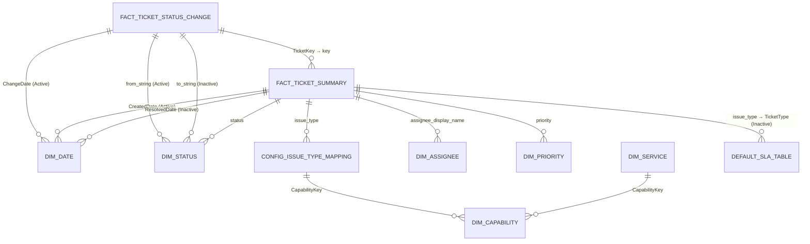

# Power BI Development Guide

## Architecture Overview

The SLO Dashboard uses a **star schema dimensional model** optimized for Power BI's VertiPaq engine. The architecture balances performance with flexibility, supporting real-time analysis across multiple business dimensions.

### Dimensional Model Design

**Core Design Principles:**
- Star schema with centralized fact tables and conforming dimensions
- Pre-calculated business logic in Power Query for optimal performance
- Active/inactive relationships enabling role-playing dimensions
- Memory-optimized data types and compression strategies

**Key Components:**
- **2 Fact Tables**: `Fact_Ticket_Status_Change` (granular), `Fact_Ticket_Summary` (aggregated)
- **6 Core Dimensions**: `Dim_Date`, `Dim_Status`, `Dim_Capability`, `Dim_Service`, `Dim_Priority`, `Dim_Assignee`
- **3 Configuration Tables**: `Config_Issue_Type_Capability_Mapping`, `Default_SLA_Table`, status rules
- **3 Aggregated Tables**: Monthly KPI summaries, daily snapshots, status transition analysis

### Star Schema Implementation



**Relationship Cardinalities:**
- All fact-to-dimension relationships: Many-to-One
- Configuration mappings: Many-to-One
- Hierarchy relationships: Many-to-One

---

## Data Model Implementation

### Fact Tables

#### Fact_Ticket_Status_Change

**Purpose**: Granular tracking of every status transition with precise business day timing

**Complete Power Query Implementation:**
```m
// Enhanced Fact_Ticket_Status_Change with comprehensive business logic
let
    // Source data with initial filtering
    Source = Table.SelectRows(Source_jira_changelog, each [field] = "status" and [active] = 1),
    
    // Join with snapshot for ticket metadata
    MergeSnapshot = Table.NestedJoin(Source, {"key"}, Source_jira_snapshot, {"key"}, 
        "SnapshotData", JoinKind.LeftOuter),
    ExpandSnapshot = Table.ExpandTableColumn(MergeSnapshot, "SnapshotData", 
        {"issue_type", "created", "assignee_display_name", "priority", "resolution_date"}, 
        {"issue_type", "ticket_created", "assignee_display_name", "priority", "resolution_date"}),
    
    // Sort for duration calculations
    SortedData = Table.Sort(ExpandSnapshot, {{"key", Order.Ascending}, {"change_created", Order.Ascending}}),
    AddIndex = Table.AddIndexColumn(SortedData, "RowIndex", 0),
    
    // Calculate previous change time using window function simulation
    AddPreviousChange = Table.AddColumn(AddIndex, "PreviousChangeTime", (currentRow) =>
        let
            CurrentKey = currentRow[key],
            CurrentIndex = currentRow[RowIndex],
            PreviousRow = Table.SelectRows(SortedData, each 
                [key] = CurrentKey and [RowIndex] < CurrentIndex),
            LastRow = if Table.RowCount(PreviousRow) > 0 then 
                Table.Last(PreviousRow)[change_created] 
            else 
                currentRow[ticket_created]
        in LastRow
    ),
    
    // Calendar hours calculation
    AddDurationCalendar = Table.AddColumn(AddPreviousChange, "DurationCalendarHours", each
        Duration.TotalHours([change_created] - [PreviousChangeTime])
    ),
    
    // Business hours calculation (excludes weekends and outside 9-5)
    AddDurationBusiness = Table.AddColumn(AddDurationCalendar, "DurationBusinessHours", each
        let
            StartTime = [PreviousChangeTime],
            EndTime = [change_created],
            StartDate = Date.From(StartTime),
            EndDate = Date.From(EndTime),
            
            // Generate list of dates between start and end
            DateList = List.Dates(StartDate, Duration.Days(EndDate - StartDate) + 1, #duration(1,0,0,0)),
            BusinessDays = List.Select(DateList, each Date.DayOfWeek(_, Day.Monday) < 5),
            
            // Calculate business hours for each day
            BusinessHours = List.Accumulate(BusinessDays, 0, (total, current) =>
                if current = StartDate and current = EndDate then
                    // Same day calculation with business hours check
                    let
                        StartHour = Time.Hour(DateTime.Time(StartTime)),
                        EndHour = Time.Hour(DateTime.Time(EndTime)),
                        BusinessStart = Number.Max(StartHour, 9),
                        BusinessEnd = Number.Min(EndHour, 17),
                        Hours = Number.Max(BusinessEnd - BusinessStart, 0)
                    in total + Hours
                else if current = StartDate then
                    // First day - from start time to 5 PM
                    let
                        StartHour = Time.Hour(DateTime.Time(StartTime)),
                        BusinessStart = Number.Max(StartHour, 9),
                        Hours = Number.Max(17 - BusinessStart, 0)
                    in total + Hours
                else if current = EndDate then
                    // Last day - from 9 AM to end time
                    let
                        EndHour = Time.Hour(DateTime.Time(EndTime)),
                        BusinessEnd = Number.Min(EndHour, 17),
                        Hours = Number.Max(BusinessEnd - 9, 0)
                    in total + Hours
                else
                    // Full business day (8 hours)
                    total + 8
            )
        in BusinessHours
    ),
    
    // Enhanced SLO timing flags with business rules
    AddSLOFlags = Table.AddColumn(AddDurationBusiness, "IsLeadTimeStart", each
        let
            LeadTimeStatuses = {"In Progress", "Development", "Analysis", "Working"},
            FromBacklog = List.Contains({"Backlog", "New", "Open", "To Do"}, [from_string]),
            ToActive = List.Contains(LeadTimeStatuses, [to_string])
        in FromBacklog and ToActive
    ),
    
    AddSLOFlags2 = Table.AddColumn(AddSLOFlags, "IsCycleTimeStart", each
        let
            CycleTimeStatuses = {"In Progress", "Development", "Testing", "Review"}
        in List.Contains(CycleTimeStatuses, [to_string]) and 
           not List.Contains(CycleTimeStatuses, [from_string])
    ),
    
    AddSLOFlags3 = Table.AddColumn(AddSLOFlags2, "IsResponseTimeEnd", each
        List.Contains({"Done", "Resolved", "Closed", "Completed"}, [to_string])
    ),
    
    // Advanced reopen detection with business rules
    AddReopenEvent = Table.AddColumn(AddSLOFlags3, "ReopenEvent", each
        let
            DoneStatuses = {"Done", "Resolved", "Closed", "Completed", "Fixed", "Won't Fix", "Duplicate"},
            OpenStatuses = {"To Do", "Open", "In Progress", "Backlog", "New", "Reopened", "Under Investigation"},
            
            FromDoneStatus = List.Contains(DoneStatuses, [from_string]),
            ToOpenStatus = List.Contains(OpenStatuses, [to_string]),
            
            // Exclude immediate corrections (< 30 minutes)
            NotImmediateCorrection = Duration.TotalMinutes([change_created] - [PreviousChangeTime]) > 30,
            
            // Ensure ticket was actually resolved for meaningful period
            WasActuallyResolved = Duration.TotalHours([change_created] - [PreviousChangeTime]) > 1
        in
            FromDoneStatus and ToOpenStatus and NotImmediateCorrection and WasActuallyResolved
    ),
    
    // Add cumulative time calculations
    AddCumulativeLeadTime = Table.AddColumn(AddReopenEvent, "CumulativeLeadTime", (currentRow) =>
        let
            CurrentKey = currentRow[key],
            LeadTimeChanges = Table.SelectRows(AddReopenEvent, each 
                [key] = CurrentKey and 
                [change_created] <= currentRow[change_created] and
                [IsLeadTimeStart] = true
            )
        in List.Sum(Table.Column(LeadTimeChanges, "DurationBusinessHours"))
    ),
    
    // Add dimension keys for relationships
    AddTicketKey = Table.AddColumn(AddCumulativeLeadTime, "TicketKey", each [key]),
    AddChangeDate = Table.AddColumn(AddTicketKey, "ChangeDate", each Date.From([change_created])),
    AddChangeTime = Table.AddColumn(AddChangeDate, "ChangeTime", each Time.From([change_created])),
    
    // Data type optimization for performance
    TypedTable = Table.TransformColumnTypes(AddChangeTime, {
        {"id", Int64.Type},
        {"key", type text},
        {"change_created", type datetimezone},
        {"from_string", type text},
        {"to_string", type text},
        {"issue_type", type text},
        {"ticket_created", type datetimezone},
        {"assignee_display_name", type text},
        {"priority", type text},
        {"DurationCalendarHours", type number},
        {"DurationBusinessHours", type number},
        {"IsLeadTimeStart", type logical},
        {"IsCycleTimeStart", type logical},
        {"IsResponseTimeEnd", type logical},
        {"ReopenEvent", type logical},
        {"CumulativeLeadTime", type number},
        {"TicketKey", type text},
        {"ChangeDate", type date},
        {"ChangeTime", type time}
    }),
    
    // Remove helper columns
    FinalTable = Table.RemoveColumns(TypedTable, {"RowIndex", "PreviousChangeTime"})
in
    FinalTable
```

#### Fact_Ticket_Summary

**Purpose**: Aggregated ticket-level metrics with pre-calculated SLO performance

**Complete Power Query Implementation:**
```m
// Enhanced Fact_Ticket_Summary with comprehensive SLO calculations
let
    Source = Table.SelectRows(Source_jira_snapshot, each [active] = 1),
    
    // Join with status changes for aggregation calculations
    JoinStatusChanges = Table.NestedJoin(Source, {"key"}, Fact_Ticket_Status_Change, {"TicketKey"}, 
        "StatusChanges", JoinKind.LeftOuter),
    
    // Calculate lead time from status changes
    AddLeadTime = Table.AddColumn(JoinStatusChanges, "TotalLeadTimeHours", each
        let
            StatusChanges = [StatusChanges],
            LeadTimeChanges = if StatusChanges <> null then 
                Table.SelectRows(StatusChanges, each [IsLeadTimeStart] = true) 
            else #table({"DurationBusinessHours"}, {}),
            TotalLeadTime = List.Sum(Table.Column(LeadTimeChanges, "DurationBusinessHours"))
        in TotalLeadTime
    ),
    
    // Calculate cycle time from status changes
    AddCycleTime = Table.AddColumn(AddLeadTime, "TotalCycleTimeHours", each
        let
            StatusChanges = [StatusChanges],
            CycleTimeChanges = if StatusChanges <> null then 
                Table.SelectRows(StatusChanges, each [IsCycleTimeStart] = true) 
            else #table({"DurationBusinessHours"}, {}),
            TotalCycleTime = List.Sum(Table.Column(CycleTimeChanges, "DurationBusinessHours"))
        in TotalCycleTime
    ),
    
    // Calculate response time (end-to-end)
    AddResponseTime = Table.AddColumn(AddCycleTime, "TotalResponseTimeHours", each
        if [resolution_date] <> null then
            Duration.TotalHours([resolution_date] - [created])
        else
            Duration.TotalHours(DateTime.LocalNow() - [created])
    ),
    
    // Get SLO targets through capability mapping
    JoinCapability = Table.NestedJoin(AddResponseTime, {"issue_type"}, 
        Config_Issue_Type_Capability_Mapping, {"IssueType"}, "CapabilityMapping", JoinKind.LeftOuter),
    ExpandCapability = Table.ExpandTableColumn(JoinCapability, "CapabilityMapping", 
        {"CapabilityKey"}, {"CapabilityKey"}),
    
    JoinSLOTargets = Table.NestedJoin(ExpandCapability, {"CapabilityKey"}, 
        Dim_Capability, {"CapabilityKey"}, "SLOTargets", JoinKind.LeftOuter),
    ExpandSLOTargets = Table.ExpandTableColumn(JoinSLOTargets, "SLOTargets", 
        {"LeadTimeTargetDays", "CycleTimeTargetDays", "ResponseTimeTargetDays"}, 
        {"LeadTimeTargetDays", "CycleTimeTargetDays", "ResponseTimeTargetDays"}),
    
    // Calculate SLO achievement flags
    AddSLOAchievement = Table.AddColumn(ExpandSLOTargets, "LeadTimeWithinSLO", each
        if [LeadTimeTargetDays] <> null then
            [TotalLeadTimeHours] <= ([LeadTimeTargetDays] * 24)
        else null
    ),
    
    AddSLOAchievement2 = Table.AddColumn(AddSLOAchievement, "CycleTimeWithinSLO", each
        if [CycleTimeTargetDays] <> null then
            [TotalCycleTimeHours] <= ([CycleTimeTargetDays] * 24)
        else null
    ),
    
    AddSLOAchievement3 = Table.AddColumn(AddSLOAchievement2, "ResponseTimeWithinSLO", each
        if [ResponseTimeTargetDays] <> null then
            [TotalResponseTimeHours] <= ([ResponseTimeTargetDays] * 24)
        else null
    ),
    
    // Add current state calculations
    AddIsResolved = Table.AddColumn(AddSLOAchievement3, "IsResolved", each [resolution_date] <> null),
    
    // Enhanced resolution time calculation (used by other measures)
    AddResolutionTimeDays = Table.AddColumn(AddIsResolved, "ResolutionTimeDays", each
        if [resolution_date] <> null then
            Duration.Days([resolution_date] - [created])
        else null
    ),
    
    // Met_SLA with hierarchical fallback logic
    AddMetSLA = Table.AddColumn(AddResolutionTimeDays, "Met_SLA", each
        if [ResolutionTimeDays] <> null and [ResponseTimeTargetDays] <> null then
            [ResolutionTimeDays] <= [ResponseTimeTargetDays]
        else null
    ),
    
    AddIsOverdue = Table.AddColumn(AddMetSLA, "IsOverdue", each
        if [ResponseTimeTargetDays] <> null and [resolution_date] = null then
            [TotalResponseTimeHours] > ([ResponseTimeTargetDays] * 24)
        else false
    ),
    
    // Calculate reopening metrics with comprehensive null handling
    AddWasReopened = Table.AddColumn(AddIsOverdue, "Was_Reopened", each
        let
            StatusChanges = [StatusChanges],
            HasChanges = StatusChanges <> null and StatusChanges <> #table({}, {}),
            
            Result = if not HasChanges then false
            else
                let
                    HasReopenEventColumn = Table.HasColumns(StatusChanges, {"ReopenEvent"}),
                    ReopenCheck = if HasReopenEventColumn then
                        let
                            ReopenEvents = Table.SelectRows(StatusChanges, each
                                [ReopenEvent] <> null and [ReopenEvent] = true
                            )
                        in Table.RowCount(ReopenEvents) > 0
                    else
                        // Fallback logic if ReopenEvent column missing
                        let
                            DoneStatuses = {"Done", "Resolved", "Closed", "Completed"},
                            OpenStatuses = {"To Do", "Open", "In Progress", "Backlog", "New"},
                            ReopenTransitions = Table.SelectRows(StatusChanges, each
                                [from_string] <> null and [to_string] <> null and
                                List.Contains(DoneStatuses, [from_string]) and
                                List.Contains(OpenStatuses, [to_string])
                            )
                        in Table.RowCount(ReopenTransitions) > 0
                in ReopenCheck
        in Result
    ),
    
    // Count reopenings
    AddReopenCount = Table.AddColumn(AddWasReopened, "Reopen_Count", each
        let
            StatusChanges = [StatusChanges]
        in
            if StatusChanges = null or StatusChanges = #table({}, {}) then 0
            else
                let
                    ReopenEvents = Table.SelectRows(StatusChanges, each
                        [ReopenEvent] <> null and [ReopenEvent] = true
                    )
                in Table.RowCount(ReopenEvents)
    ),
    
    // Add date dimensions for relationships
    AddCreatedDate = Table.AddColumn(AddReopenCount, "CreatedDate", each Date.From([created])),
    AddResolvedDate = Table.AddColumn(AddCreatedDate, "ResolvedDate", each 
        if [resolution_date] <> null then Date.From([resolution_date]) else null),
    AddUpdatedDate = Table.AddColumn(AddResolvedDate, "UpdatedDate", each Date.From([updated])),
    
    // Calculate additional metrics
    AddDaysInCurrentStatus = Table.AddColumn(AddUpdatedDate, "DaysInCurrentStatus", each
        Duration.Days(DateTime.LocalNow() - [updated])
    ),
    
    CountStatusChanges = Table.AddColumn(AddDaysInCurrentStatus, "TotalStatusChanges", each
        let StatusChanges = [StatusChanges]
        in if StatusChanges <> null then Table.RowCount(StatusChanges) else 0
    ),
    
    // Remove nested tables for performance
    RemoveNestedTables = Table.RemoveColumns(CountStatusChanges, {"StatusChanges", "CapabilityMapping", "SLOTargets"}),
    
    // Final data typing for optimal performance
    TypedTable = Table.TransformColumnTypes(RemoveNestedTables, {
        {"id", Int64.Type},
        {"key", type text},
        {"issue_type", type text},
        {"subtask", type logical},
        {"status", type text},
        {"created", type datetimezone},
        {"updated", type datetimezone},
        {"resolution_date", type datetimezone},
        {"summary", type text},
        {"assignee_display_name", type text},
        {"priority", type text},
        {"TotalLeadTimeHours", type number},
        {"TotalCycleTimeHours", type number},
        {"TotalResponseTimeHours", type number},
        {"LeadTimeTargetDays", type number},
        {"CycleTimeTargetDays", type number},
        {"ResponseTimeTargetDays", type number},
        {"LeadTimeWithinSLO", type logical},
        {"CycleTimeWithinSLO", type logical},
        {"ResponseTimeWithinSLO", type logical},
        {"IsResolved", type logical},
        {"ResolutionTimeDays", Int64.Type},
        {"Met_SLA", type logical},
        {"IsOverdue", type logical},
        {"Was_Reopened", type logical},
        {"Reopen_Count", Int64.Type},
        {"DaysInCurrentStatus", Int64.Type},
        {"TotalStatusChanges", Int64.Type},
        {"CreatedDate", type date},
        {"ResolvedDate", type date},
        {"UpdatedDate", type date}
    })
in
    TypedTable
```

### Configuration Tables

#### Default_SLA_Table

**Purpose**: Fallback SLA definitions for comprehensive coverage

**Power Query Implementation:**
```m
// Default SLA Table with comprehensive business rules
let
    Source = #table(
        {"TicketType", "SLA_Days", "DefaultCriticality", "Notes", "ExcludeWeekends", "BusinessDaysOnly"},
        {
            {"Bug", 3, "High", "Critical defects require faster response", true, true},
            {"Task", 5, "Standard", "Standard business day response target", true, true},
            {"Epic", 10, "Medium", "Large initiatives allow longer response time", true, true},
            {"Story", 7, "Standard", "User stories standard processing", true, true},
            {"Sub-task", 2, "Standard", "Sub-tasks inherit parent priority but faster turnaround", true, true},
            {"Improvement", 7, "Medium", "Enhancement requests standard timeline", true, true},
            {"New Feature", 15, "Low", "New features require extended analysis time", true, true},
            {"Change Request", 10, "Medium", "Change management standard process", true, true},
            {"Incident", 1, "Critical", "Production incidents have highest priority", false, false},
            {"Service Request", 5, "Standard", "Standard service delivery", true, true}
        }
    ),
    
    // Add metadata columns
    AddSLAType = Table.AddColumn(Source, "SLA_Type", each "Response Time"),
    AddActive = Table.AddColumn(AddSLAType, "IsActive", each true),
    AddCreated = Table.AddColumn(AddActive, "CreatedDate", each Date.From(DateTime.LocalNow())),
    AddSurrogateKey = Table.AddIndexColumn(AddCreated, "SLA_Key", 1, 1),
    
    // Data type optimization
    TypedTable = Table.TransformColumnTypes(AddSurrogateKey, {
        {"SLA_Key", Int64.Type},
        {"TicketType", type text},
        {"SLA_Days", type number},
        {"DefaultCriticality", type text},
        {"Notes", type text},
        {"ExcludeWeekends", type logical},
        {"BusinessDaysOnly", type logical},
        {"IsActive", type logical},
        {"CreatedDate", type date}
    })
in
    TypedTable
```

#### Config_Issue_Type_Capability_Mapping

**Purpose**: Maps Jira issue types to business capabilities

**Power Query Implementation:**
```m
// Issue Type to Capability Mapping with validation
let
    Source = #table(
        {"IssueType", "CapabilityKey", "ServiceKey", "Notes"},
        {
            {"Bug", "DQ", "DQ-VALIDATE", "Data quality defects"},
            {"Data Quality Task", "DQ", "DQ-MONITOR", "Ongoing monitoring tasks"},
            {"Extract Request", "DE", "DE-CUSTOM", "Custom data extractions"},
            {"Scheduled Extract", "DE", "DE-AUTOMATED", "Automated extract maintenance"},
            {"Change Request", "CC", "CC-APPROVAL", "Change approval workflow"},
            {"Change Implementation", "CC", "CC-DEPLOY", "Change deployment"},
            {"Reference Data Update", "RD", "RD-UPDATE", "Reference data maintenance"},
            {"Data Classification", "RD", "RD-CLASSIFY", "Data classification tasks"},
            {"Records Retention", "RM", "RM-ARCHIVE", "Records archival process"},
            {"Records Retrieval", "RM", "RM-RETRIEVE", "Records retrieval requests"}
        }
    ),
    
    // Add validation and metadata
    AddMappingKey = Table.AddIndexColumn(Source, "MappingKey", 1, 1),
    AddActive = Table.AddColumn(AddMappingKey, "IsActive", each true),
    AddCreated = Table.AddColumn(AddActive, "CreatedDate", each Date.From(DateTime.LocalNow())),
    
    // Data type optimization
    TypedTable = Table.TransformColumnTypes(AddCreated, {
        {"MappingKey", Int64.Type},
        {"IssueType", type text},
        {"CapabilityKey", type text},
        {"ServiceKey", type text},
        {"Notes", type text},
        {"IsActive", type logical},
        {"CreatedDate", type date}
    })
in
    TypedTable
```

### Dimension Tables

#### Dim_Date (Enhanced Implementation)

```m
// Comprehensive date dimension with SLO-specific business rules
let
    StartDate = #date(2023, 1, 1),
    EndDate = #date(2027, 12, 31),
    DateList = List.Dates(StartDate, Duration.Days(EndDate - StartDate) + 1, #duration(1,0,0,0)),
    
    // Create base date table
    DateTable = Table.FromList(DateList, Splitter.SplitByNothing(), {"Date"}),
    
    // Add calendar hierarchy
    AddYear = Table.AddColumn(DateTable, "Year", each Date.Year([Date])),
    AddMonth = Table.AddColumn(AddYear, "Month", each Date.Month([Date])),
    AddQuarter = Table.AddColumn(AddMonth, "Quarter", each Date.QuarterOfYear([Date])),
    AddMonthName = Table.AddColumn(AddQuarter, "MonthName", each Date.MonthName([Date])),
    AddQuarterName = Table.AddColumn(AddMonthName, "QuarterName", each "Q" & Text.From([Quarter])),
    
    // Add week information
    AddWeekOfYear = Table.AddColumn(AddQuarterName, "WeekOfYear", each Date.WeekOfYear([Date])),
    AddWeekStart = Table.AddColumn(AddWeekOfYear, "WeekStart", each Date.StartOfWeek([Date], Day.Monday)),
    
    // Business day calculations
    AddDayOfWeek = Table.AddColumn(AddWeekStart, "DayOfWeek", each Date.DayOfWeek([Date], Day.Monday) + 1),
    AddDayName = Table.AddColumn(AddDayOfWeek, "DayName", each Date.DayOfWeekName([Date])),
    AddIsBusinessDay = Table.AddColumn(AddDayName, "IsBusinessDay", each [DayOfWeek] <= 5),
    AddIsWeekend = Table.AddColumn(AddIsBusinessDay, "IsWeekend", each [DayOfWeek] > 5),
    
    // Month boundaries for aggregations
    AddMonthStart = Table.AddColumn(AddIsWeekend, "MonthStart", each Date.StartOfMonth([Date])),
    AddMonthEnd = Table.AddColumn(AddMonthStart, "MonthEnd", each Date.EndOfMonth([Date])),
    
    // Add relative date calculations
    AddIsToday = Table.AddColumn(AddMonthEnd, "IsToday", each [Date] = Date.From(DateTime.LocalNow())),
    AddIsYTD = Table.AddColumn(AddIsToday, "IsYTD", each 
        [Year] = Date.Year(DateTime.LocalNow()) and [Date] <= Date.From(DateTime.LocalNow())),
    
    // Add fiscal year (assuming April start)
    AddFiscalYear = Table.AddColumn(AddIsYTD, "FiscalYear", each 
        if [Month] >= 4 then [Year] else [Year] - 1),
    
    // Optimize data types
    TypedTable = Table.TransformColumnTypes(AddFiscalYear, {
        {"Date", type date},
        {"Year", Int64.Type},
        {"Month", Int64.Type},
        {"Quarter", Int64.Type},
        {"MonthName", type text},
        {"QuarterName", type text},
        {"WeekOfYear", Int64.Type},
        {"WeekStart", type date},
        {"DayOfWeek", Int64.Type},
        {"DayName", type text},
        {"IsBusinessDay", type logical},
        {"IsWeekend", type logical},
        {"MonthStart", type date},
        {"MonthEnd", type date},
        {"IsToday", type logical},
        {"IsYTD", type logical},
        {"FiscalYear", Int64.Type}
    })
in
    TypedTable
```

### Relationships Configuration

**Complete Relationship Setup:**
```javascript
// Active Relationships (Primary navigation paths)
Model.Relationships.add({
    name: "TicketSummary_CreatedDate_Date",
    from: "Fact_Ticket_Summary[CreatedDate]",
    to: "Dim_Date[Date]",
    cardinality: "ManyToOne",
    crossFilterDirection: "Both",
    isActive: true
});

Model.Relationships.add({
    name: "StatusChange_ChangeDate_Date", 
    from: "Fact_Ticket_Status_Change[ChangeDate]",
    to: "Dim_Date[Date]",
    cardinality: "ManyToOne",
    crossFilterDirection: "Both",
    isActive: true
});

Model.Relationships.add({
    name: "TicketSummary_IssueType_Mapping",
    from: "Fact_Ticket_Summary[issue_type]",
    to: "Config_Issue_Type_Capability_Mapping[IssueType]",
    cardinality: "ManyToOne",
    crossFilterDirection: "Both",
    isActive: true
});

Model.Relationships.add({
    name: "Mapping_Capability",
    from: "Config_Issue_Type_Capability_Mapping[CapabilityKey]",
    to: "Dim_Capability[CapabilityKey]",
    cardinality: "ManyToOne",
    crossFilterDirection: "Both", 
    isActive: true
});

// Inactive Relationships (For role-playing dimensions)
Model.Relationships.add({
    name: "TicketSummary_ResolvedDate_Date",
    from: "Fact_Ticket_Summary[ResolvedDate]",
    to: "Dim_Date[Date]",
    cardinality: "ManyToOne",
    crossFilterDirection: "Both",
    isActive: false
});

Model.Relationships.add({
    name: "StatusChange_FromStatus_Status",
    from: "Fact_Ticket_Status_Change[from_string]",
    to: "Dim_Status[status]",
    cardinality: "ManyToOne",
    crossFilterDirection: "Both",
    isActive: true
});

Model.Relationships.add({
    name: "StatusChange_ToStatus_Status",
    from: "Fact_Ticket_Status_Change[to_string]",
    to: "Dim_Status[status]",
    cardinality: "ManyToOne", 
    crossFilterDirection: "Both",
    isActive: false
});

Model.Relationships.add({
    name: "TicketSummary_DefaultSLA",
    from: "Fact_Ticket_Summary[issue_type]",
    to: "Default_SLA_Table[TicketType]",
    cardinality: "ManyToOne",
    crossFilterDirection: "Both",
    isActive: false
});
```

---

## Power Query Transformations

### Source Data Processing

**Optimized Source Queries:**
```m
// Jira Snapshot - Optimized with query folding
Source_jira_snapshot = Sql.Database("production-server", "jira_db", [
    Query = "
        SELECT s.* 
        FROM jira_snapshot s
        WHERE s.active = 1 
          AND s.created >= DATEADD(month, -6, GETDATE())
          AND s.project_key IN ('DATA', 'QUAL', 'EXTR')
        ORDER BY s.created DESC
    "
])

// Jira Changelog - Filtered for status changes only
Source_jira_changelog = Sql.Database("production-server", "jira_db", [
    Query = "
        SELECT c.*
        FROM jira_changelog c
        WHERE c.active = 1 
          AND c.field = 'status'
          AND c.change_created >= DATEADD(month, -6, GETDATE())
        ORDER BY c.key, c.change_created
    "
])
```

### Business Rules Implementation

**Advanced Status Classification:**
```m
// Enhanced status mapping with business rules
AddStatusClassification = Table.AddColumn(StatusTable, "StatusClassification", each
    let
        Status = [status],
        Classification = 
            if List.Contains({"New", "Open", "To Do", "Backlog"}, Status) then "Intake"
            else if List.Contains({"In Progress", "Development", "Analysis"}, Status) then "Active"
            else if List.Contains({"Testing", "Review", "Validation"}, Status) then "Verification"
            else if List.Contains({"Waiting", "Blocked", "On Hold"}, Status) then "Waiting"
            else if List.Contains({"Done", "Resolved", "Closed"}, Status) then "Complete"
            else "Other"
    in Classification
),

// Priority-based SLA adjustments
AddPriorityMultiplier = Table.AddColumn(PriorityTable, "SLAMultiplier", each
    switch [priority]
        case "P1" => 0.5    // 50% of standard time
        case "P2" => 0.75   // 75% of standard time  
        case "P3" => 1.0    // Standard time
        case "P4" => 1.5    // 150% of standard time
        otherwise 1.0
)
```

### Performance Optimization Techniques

**Query Folding Verification:**
```m
// Verify query folding at each step
let
    Source = Sql.Database("server", "database"), // ✓ Foldable
    FilterActive = Table.SelectRows(Source, each [active] = 1), // ✓ Foldable
    FilterDates = Table.SelectRows(FilterActive, each [created] >= #date(2024,1,1)), // ✓ Foldable
    AddCalculation = Table.AddColumn(FilterDates, "Custom", each [field1] + [field2]), // ❌ Not foldable
    // Solution: Move calculations to later steps or use database functions
    TypedData = Table.TransformColumnTypes(FilterDates, {{"created", type datetime}}) // ✓ Foldable
in TypedData
```

**Incremental Refresh Setup:**
```m
// Parameters for incremental refresh
RangeStart = #datetime(2020, 1, 1, 0, 0, 0) meta [IsParameterQuery=true, Type="DateTime", IsParameterQueryRequired=true],
RangeEnd = #datetime(2030, 12, 31, 23, 59, 59) meta [IsParameterQuery=true, Type="DateTime", IsParameterQueryRequired=true],

// Apply incremental filter
FilteredSource = Table.SelectRows(Source, each 
    [created] >= RangeStart and [created] < RangeEnd
)

// Incremental refresh policy (configured in Power BI Service):
// - Historical: 24 months
// - Refresh: 1 month  
// - Detect changes: Yes (based on [updated] column)
```

---

## DAX Calculations

### Enhanced Calculated Columns

**ResolutionTimeDays with Business Logic:**
```dax
ResolutionTimeDays = 
VAR CreatedDate = Fact_Ticket_Summary[created]
VAR ResolvedDate = Fact_Ticket_Summary[resolution_date]
VAR CurrentDate = NOW()

-- Handle timezone conversions if needed
VAR CreatedDateLocal = DATEVALUE(CreatedDate) + TIMEVALUE(CreatedDate)  
VAR ResolvedDateLocal = IF(
    ResolvedDate <> BLANK(),
    DATEVALUE(ResolvedDate) + TIMEVALUE(ResolvedDate),
    CurrentDate
)

-- Calculate resolution time with validation
VAR ResolutionDays = DATEDIFF(CreatedDateLocal, ResolvedDateLocal, DAY)

-- Ensure non-negative values and handle edge cases
VAR FinalResult = 
    SWITCH(
        TRUE(),
        ResolutionDays < 0, 0,
        ResolutionDays > 365, 365, -- Cap at 1 year to prevent outliers
        ResolutionDays
    )

RETURN FinalResult
```

**Met_SLA with Hierarchical Logic:**
```dax
Met_SLA = 
VAR ActualResolutionDays = Fact_Ticket_Summary[ResolutionTimeDays]
VAR IsResolved = Fact_Ticket_Summary[resolution_date] <> BLANK()
VAR IssueType = Fact_Ticket_Summary[issue_type]

-- Get SLA target using hierarchical fallback approach
VAR SLA_Target = 
    -- Priority 1: Service-specific SLA override
    COALESCE(
        RELATED(Dim_Service[ServiceResponseTimeTarget]),
        
        -- Priority 2: Capability-level SLA
        CALCULATE(
            RELATED(Dim_Capability[ResponseTimeTargetDays]),
            USERELATIONSHIP(Fact_Ticket_Summary[issue_type], Config_Issue_Type_Capability_Mapping[IssueType])
        ),
        
        -- Priority 3: Default SLA fallback
        CALCULATE(
            MAX(Default_SLA_Table[SLA_Days]),
            USERELATIONSHIP(Fact_Ticket_Summary[issue_type], Default_SLA_Table[TicketType]),
            Default_SLA_Table[IsActive] = TRUE
        ),
        
        -- Priority 4: Ultimate fallback
        5
    )

-- Apply priority adjustments if configured
VAR PriorityMultiplier = 
    SWITCH(
        Fact_Ticket_Summary[priority],
        "P1", 0.5,
        "P2", 0.75, 
        "P3", 1.0,
        "P4", 1.5,
        1.0
    )

VAR AdjustedSLA = SLA_Target * PriorityMultiplier

-- Determine SLA achievement
VAR SLA_Result = 
    SWITCH(
        TRUE(),
        -- Case 1: Ticket not resolved yet
        NOT IsResolved, BLANK(),
        
        -- Case 2: Invalid data
        OR(AdjustedSLA <= 0, ActualResolutionDays < 0), BLANK(),
        
        -- Case 3: SLA met
        ActualResolutionDays <= AdjustedSLA, TRUE(),
        
        -- Case 4: SLA missed  
        ActualResolutionDays > AdjustedSLA, FALSE(),
        
        -- Default case
        BLANK()
    )

RETURN SLA_Result
```

### Core KPI Measures

**SLO Achievement Rate (Enhanced):**
```dax
SLO_Achievement_Rate = 
VAR ResolvedTicketsTable = 
    CALCULATETABLE(
        FILTER(
            Fact_Ticket_Summary,
            [resolution_date] <> BLANK() &&
            [Met_SLA] <> BLANK()
        )
    )
    
VAR TotalResolved = COUNTROWS(ResolvedTicketsTable)
VAR WithinSLO = 
    COUNTROWS(
        FILTER(
            ResolvedTicketsTable,
            [Met_SLA] = TRUE
        )
    )

VAR AchievementRate = DIVIDE(WithinSLO, TotalResolved, 0) * 100

-- Add confidence intervals for small sample sizes
VAR ConfidenceInterval = 
    IF(
        TotalResolved < 30,
        SQRT((AchievementRate/100) * (1 - AchievementRate/100) / TotalResolved) * 1.96 * 100,
        0
    )

RETURN AchievementRate
```

**Advanced Time Intelligence Measures:**
```dax
-- Month-over-Month with seasonal adjustment
MoM_SLO_Change = 
VAR CurrentMonth = [SLO_Achievement_Rate]
VAR PreviousMonth = 
    CALCULATE(
        [SLO_Achievement_Rate],
        DATEADD(Dim_Date[Date], -1, MONTH)
    )
VAR YearAgoSameMonth = 
    CALCULATE(
        [SLO_Achievement_Rate],
        DATEADD(Dim_Date[Date], -12, MONTH)
    )

-- Calculate both sequential and seasonal change
VAR SequentialChange = CurrentMonth - PreviousMonth
VAR SeasonalChange = CurrentMonth - YearAgoSameMonth

RETURN 
    IF(
        ISBLANK(PreviousMonth),
        BLANK(),
        SequentialChange
    )

-- Rolling 6-month average with trend calculation
Six_Month_Avg_SLO = 
VAR SixMonthData = 
    CALCULATETABLE(
        SUMMARIZE(
            Fact_Ticket_Summary,
            Dim_Date[MonthStart],
            "Monthly_SLO", [SLO_Achievement_Rate]
        ),
        DATESINPERIOD(Dim_Date[Date], MAX(Dim_Date[Date]), -6, MONTH)
    )

VAR AveragePerformance = AVERAGEX(SixMonthData, [Monthly_SLO])

-- Calculate trend direction
VAR TrendSlope = 
    VAR X_Values = ADDCOLUMNS(SixMonthData, "MonthNumber", DATEDIFF(MIN([MonthStart]), [MonthStart], MONTH))
    VAR SumX = SUMX(X_Values, [MonthNumber])
    VAR SumY = SUMX(X_Values, [Monthly_SLO])
    VAR SumXY = SUMX(X_Values, [MonthNumber] * [Monthly_SLO])
    VAR SumX2 = SUMX(X_Values, [MonthNumber] * [MonthNumber])
    VAR N = COUNTROWS(X_Values)
    VAR Slope = (N * SumXY - SumX * SumY) / (N * SumX2 - SumX * SumX)
    RETURN Slope

RETURN AveragePerformance
```

**Capability-Level Analysis:**
```dax
-- Comprehensive capability performance measure
Capability_Performance_Score = 
VAR SLO_Score = [SLO_Achievement_Rate] / 100
VAR Volume_Score = 
    DIVIDE(
        [Monthly_Throughput],
        CALCULATE([Monthly_Throughput], ALL(Dim_Capability)),
        0
    )
VAR Quality_Score = 
    DIVIDE(
        [First_Pass_Resolution_Rate],
        100,
        0
    )

-- Weighted composite score
VAR CompositeScore = 
    (SLO_Score * 0.5) +      -- 50% weight on SLO achievement
    (Volume_Score * 0.3) +    -- 30% weight on volume
    (Quality_Score * 0.2)     -- 20% weight on quality

-- Convert to percentage and classify
VAR PerformanceRating = 
    SWITCH(
        TRUE(),
        CompositeScore >= 0.9, "Excellent",
        CompositeScore >= 0.8, "Good", 
        CompositeScore >= 0.7, "Fair",
        CompositeScore >= 0.6, "Needs Improvement",
        "Critical"
    )

RETURN CompositeScore * 100
```

### Calculated Tables for Performance

**Monthly KPI Summary (Pre-Aggregated):**
```dax
Monthly_KPI_Summary_By_Capability = 
ADDCOLUMNS(
    CROSSJOIN(
        VALUES(Dim_Capability[CapabilityKey]),
        SUMMARIZE(
            Dim_Date,
            Dim_Date[Year],
            Dim_Date[Month],
            "MonthStart", MIN(Dim_Date[Date]),
            "MonthEnd", MAX(Dim_Date[Date])
        )
    ),
    "CapabilityKey", Dim_Capability[CapabilityKey],
    "YearMonth", [Year] * 100 + [Month],
    
    -- Core KPIs
    "SLO_Achievement", 
        CALCULATE(
            [SLO_Achievement_Rate],
            Fact_Ticket_Summary[CreatedDate] >= EARLIER([MonthStart]),
            Fact_Ticket_Summary[CreatedDate] <= EARLIER([MonthEnd])
        ),
    
    "Total_Tickets_Created",
        CALCULATE(
            COUNTROWS(Fact_Ticket_Summary),
            Fact_Ticket_Summary[CreatedDate] >= EARLIER([MonthStart]),
            Fact_Ticket_Summary[CreatedDate] <= EARLIER([MonthEnd])
        ),
    
    "Total_Tickets_Resolved",
        CALCULATE(
            COUNTROWS(Fact_Ticket_Summary),
            Fact_Ticket_Summary[ResolvedDate] >= EARLIER([MonthStart]),
            Fact_Ticket_Summary[ResolvedDate] <= EARLIER([MonthEnd]),
            USERELATIONSHIP(Fact_Ticket_Summary[ResolvedDate], Dim_Date[Date])
        ),
    
    "Avg_Resolution_Days",
        CALCULATE(
            AVERAGE(Fact_Ticket_Summary[ResolutionTimeDays]),
            Fact_Ticket_Summary[ResolvedDate] >= EARLIER([MonthStart]),
            Fact_Ticket_Summary[ResolvedDate] <= EARLIER([MonthEnd]),
            USERELATIONSHIP(Fact_Ticket_Summary[ResolvedDate], Dim_Date[Date])
        ),
    
    -- Advanced metrics
    "First_Pass_Resolution_Rate",
        CALCULATE(
            DIVIDE(
                COUNTROWS(FILTER(Fact_Ticket_Summary, [Was_Reopened] = FALSE)),
                COUNTROWS(FILTER(Fact_Ticket_Summary, [IsResolved] = TRUE)),
                0
            ) * 100,
            Fact_Ticket_Summary[ResolvedDate] >= EARLIER([MonthStart]),
            Fact_Ticket_Summary[ResolvedDate] <= EARLIER([MonthEnd]),
            USERELATIONSHIP(Fact_Ticket_Summary[ResolvedDate], Dim_Date[Date])
        ),
    
    "Tickets_At_Risk",
        CALCULATE(
            COUNTROWS(
                FILTER(
                    Fact_Ticket_Summary,
                    [IsOverdue] = TRUE
                )
            ),
            Fact_Ticket_Summary[CreatedDate] >= EARLIER([MonthStart]),
            Fact_Ticket_Summary[CreatedDate] <= EARLIER([MonthEnd])
        )
)
```

---

## Dashboard Development

### Report Design Framework

**Page Layout Strategy:**
1. **Executive Summary Page**
   - KPI cards with traffic light indicators
   - Trend lines with forecasting
   - High-level capability comparison
   - Alert status summary

2. **Operational Dashboard Page**
   - Detailed tables with drill-down capability
   - Status flow visualization
   - Assignee performance matrix
   - Bottleneck identification

3. **Analytical Deep-Dive Page**
   - Statistical analysis and distributions
   - Correlation analysis between KPIs
   - Predictive insights and recommendations
   - Data quality monitoring

### Visual Design Standards

**Color Palette:**
```dax
-- Color definitions for consistent branding
SLO_Color_Green = "#2E7D32"     -- Excellent performance (>95%)
SLO_Color_Yellow = "#F57C00"    -- Good performance (85-95%)
SLO_Color_Red = "#C62828"       -- Needs attention (<85%)
SLO_Color_Gray = "#757575"      -- No data/inactive

-- Dynamic color assignment
Dynamic_SLO_Color = 
SWITCH(
    TRUE(),
    [SLO_Achievement_Rate] >= 95, SLO_Color_Green,
    [SLO_Achievement_Rate] >= 85, SLO_Color_Yellow,
    [SLO_Achievement_Rate] > 0, SLO_Color_Red,
    SLO_Color_Gray
)
```

**Conditional Formatting Rules:**
```dax
-- Icon set for KPI cards
SLO_Icon = 
SWITCH(
    TRUE(),
    [SLO_Achievement_Rate] >= 95, "▲",
    [SLO_Achievement_Rate] >= 85, "●",
    [SLO_Achievement_Rate] > 0, "▼",
    "○"
)

-- Data bars for table visuals
SLO_DataBar_Scale = 
VAR MaxSLO = 100
VAR CurrentSLO = [SLO_Achievement_Rate]
RETURN DIVIDE(CurrentSLO, MaxSLO, 0)
```

### Advanced Visualizations

**Custom SLO Gauge Visual:**
```dax
-- SLO Gauge measure for custom visual
SLO_Gauge_Value = [SLO_Achievement_Rate]
SLO_Gauge_Target = 95
SLO_Gauge_Maximum = 100

-- Gauge color zones
SLO_Gauge_Color = 
SWITCH(
    TRUE(),
    [SLO_Gauge_Value] >= [SLO_Gauge_Target], "green",
    [SLO_Gauge_Value] >= 85, "yellow", 
    "red"
)
```

**Time Series with Confidence Intervals:**
```dax
-- Confidence interval calculation for trending
SLO_Confidence_Upper = 
VAR BaseValue = [SLO_Achievement_Rate]
VAR SampleSize = [Total_Resolved_Tickets]
VAR StandardError = SQRT((BaseValue/100) * (1 - BaseValue/100) / SampleSize) * 100
VAR ConfidenceInterval = 1.96 * StandardError
RETURN BaseValue + ConfidenceInterval

SLO_Confidence_Lower = 
VAR BaseValue = [SLO_Achievement_Rate]
VAR SampleSize = [Total_Resolved_Tickets]
VAR StandardError = SQRT((BaseValue/100) * (1 - BaseValue/100) / SampleSize) * 100
VAR ConfidenceInterval = 1.96 * StandardError
RETURN BaseValue - ConfidenceInterval
```

### Mobile Optimization

**Mobile-First Design Principles:**
- Single-column layouts with scrollable sections
- Larger touch targets (minimum 44px)
- Simplified color schemes for better contrast
- Essential metrics prioritized at the top

**Mobile-Specific Measures:**
```dax
-- Mobile KPI summary (compressed format)
Mobile_SLO_Summary = 
"SLO: " & FORMAT([SLO_Achievement_Rate], "0.0%") & 
" | Tickets: " & [Total_Tickets_This_Month] &
" | Trend: " & 
    IF([MoM_SLO_Change] > 0, "↗", IF([MoM_SLO_Change] < 0, "↘", "→"))
```

**Mobile Page Configuration:**
- Executive Summary (mobile): Key KPIs only
- Quick Status (mobile): Alerts and at-risk tickets  
- Capability View (mobile): Single capability deep-dive

---

## Performance Optimization

### Memory Management Strategies

**Column Store Optimization:**
```m
// Optimize column data types for compression
OptimizeDataTypes = Table.TransformColumnTypes(SourceTable, {
    // Use smallest applicable integer types
    {"id", Int64.Type},
    {"count_field", Int32.Type},
    {"flag_field", type logical},
    
    // Use text only when necessary
    {"category_field", type text},
    
    // Optimize decimals to 2 places for monetary fields
    {"amount_field", Currency.Type},
    
    // Use date/datetime consistently
    {"date_field", type date},
    {"timestamp_field", type datetime}
})
```

**Relationship Optimization:**
```javascript
// Minimize bidirectional cross-filtering
Model.Relationships.configure({
    crossFilterDirection: "Single",  // Use bidirectional only when necessary
    securityFiltering: "None",       // Avoid unless required for RLS
    cardinality: "ManyToOne"         // Preferred for performance
});
```

### Query Performance Tuning

**DAX Performance Best Practices:**
```dax
-- Use variables to avoid repeated calculations
Optimized_Complex_Measure = 
VAR FilteredTable = 
    FILTER(
        Fact_Ticket_Summary,
        [IsResolved] = TRUE &&
        [CreatedDate] >= DATE(2024, 1, 1)
    )
VAR TotalTickets = COUNTROWS(FilteredTable)
VAR SLOTickets = COUNTROWS(FILTER(FilteredTable, [Met_SLA] = TRUE))
RETURN DIVIDE(SLOTickets, TotalTickets, 0)

-- Use SUMMARIZE for better performance with grouping
Capability_Summary_Optimized = 
SUMMARIZE(
    Fact_Ticket_Summary,
    Dim_Capability[CapabilityName],
    "SLO_Rate", [SLO_Achievement_Rate],
    "Total_Tickets", [Total_Tickets_This_Month]
)

-- Prefer CALCULATE over complex filters
Efficient_Time_Filter = 
CALCULATE(
    [SLO_Achievement_Rate],
    Dim_Date[Year] = 2024,
    Dim_Date[Month] = 3
)
-- Instead of complex FILTER expressions
```

### Aggregation Tables

**Automatic Aggregations:**
```dax
-- Configure aggregations for large fact tables
-- (Configured in Power BI Desktop via Aggregations tab)

DEFINE AGGREGATION Fact_Ticket_Summary_Monthly_Agg
SUMMARIZE(
    Fact_Ticket_Summary,
    Dim_Date[Year],
    Dim_Date[Month], 
    Dim_Capability[CapabilityKey]
) 
GROUP BY (
    "Total_Tickets", SUM(1),
    "Avg_Resolution_Days", AVERAGE(Fact_Ticket_Summary[ResolutionTimeDays]),
    "SLO_Breaches", SUM(IF(Fact_Ticket_Summary[Met_SLA] = FALSE, 1, 0))
)
```

**Manual Pre-Aggregation:**
```dax
-- Create manual summary table for complex calculations
Daily_SLO_Snapshot = 
ADDCOLUMNS(
    CROSSJOIN(
        VALUES(Dim_Date[Date]),
        VALUES(Dim_Capability[CapabilityKey])
    ),
    "Date", Dim_Date[Date],
    "CapabilityKey", Dim_Capability[CapabilityKey],
    "Daily_SLO_Rate", 
        CALCULATE(
            [SLO_Achievement_Rate],
            FILTER(
                ALL(Dim_Date),
                Dim_Date[Date] = EARLIER(Dim_Date[Date])
            )
        ),
    "Cumulative_Tickets",
        CALCULATE(
            COUNTROWS(Fact_Ticket_Summary),
            FILTER(
                ALL(Dim_Date),
                Dim_Date[Date] <= EARLIER(Dim_Date[Date])
            )
        )
)
```

### Incremental Refresh Configuration

**Setup for Large Datasets:**
```m
// Step 1: Create DateTime parameters (required for incremental refresh)
RangeStart = #datetime(2020, 1, 1, 0, 0, 0) meta [IsParameterQuery=true, Type="DateTime"],
RangeEnd = #datetime(2030, 12, 31, 23, 59, 59) meta [IsParameterQuery=true, Type="DateTime"],

// Step 2: Apply filter using parameters
Fact_Ticket_Summary_Incremental = 
let
    Source = <your_source_query>,
    FilteredData = Table.SelectRows(Source, each 
        [created] >= RangeStart and [created] < RangeEnd
    )
in FilteredData

// Step 3: Configure policy in Power BI Service
// Archive data: 2 years
// Refresh data: 3 months
// Detect data changes: Yes (based on 'updated' column)
```

---

## Testing and Validation

### Comprehensive Test Framework

**Data Validation Tests:**
```dax
-- Test 1: Record count validation
Test_Record_Count = 
VAR PowerBI_Count = COUNTROWS(Fact_Ticket_Summary)
VAR Expected_Min = 1000  -- Adjust based on expected data volume
VAR Expected_Max = 100000
VAR Status = 
    SWITCH(
        TRUE(),
        PowerBI_Count < Expected_Min, "FAIL - Too few records",
        PowerBI_Count > Expected_Max, "FAIL - Too many records", 
        "PASS"
    )
RETURN PowerBI_Count & " records - " & Status

-- Test 2: SLA calculation accuracy
Test_SLA_Calculation = 
VAR TestCases = {
    ("TICKET-001", 2, 3, TRUE),
    ("TICKET-002", 5, 3, FALSE),
    ("TICKET-003", 3, 3, TRUE)
}
VAR ValidationResults = 
    ADDCOLUMNS(
        DATATABLE(
            "TicketKey", STRING,
            "ActualDays", INTEGER,
            "TargetDays", INTEGER,
            "ExpectedResult", BOOLEAN,
            TestCases
        ),
        "ActualResult", 
            LOOKUPVALUE(
                Fact_Ticket_Summary[Met_SLA],
                Fact_Ticket_Summary[key], [TicketKey]
            ),
        "TestStatus", 
            IF([ExpectedResult] = [ActualResult], "PASS", "FAIL")
    )
RETURN CONCATENATEX(ValidationResults, [TestStatus], ", ")

-- Test 3: Data freshness validation
Test_Data_Freshness = 
VAR MaxDataDate = MAX(Fact_Ticket_Summary[created])
VAR CurrentDate = TODAY()
VAR DaysOld = DATEDIFF(MaxDataDate, CurrentDate, DAY)
VAR Status = IF(DaysOld <= 1, "PASS", "FAIL - Data older than 1 day")
RETURN FORMAT(MaxDataDate, "MMM DD, YYYY") & " - " & Status

-- Test 4: Relationship integrity
Test_Relationship_Integrity = 
VAR OrphanedTickets = 
    COUNTROWS(
        FILTER(
            Fact_Ticket_Summary,
            ISBLANK(RELATED(Dim_Date[Date]))
        )
    )
VAR Status = IF(OrphanedTickets = 0, "PASS", "FAIL - " & OrphanedTickets & " orphaned records")
RETURN Status
```

**Performance Validation:**
```dax
-- Measure execution time (for development testing)
Performance_Test_SLO_Rate = 
VAR StartTime = UTCNOW()
VAR Result = [SLO_Achievement_Rate]
VAR EndTime = UTCNOW()
VAR ExecutionTimeMS = DATEDIFF(StartTime, EndTime, SECOND) * 1000
RETURN "Result: " & Result & "% | Time: " & ExecutionTimeMS & "ms"

-- Memory usage estimation
Memory_Usage_Estimate = 
VAR TableRowCounts = 
    "Fact_Ticket_Summary: " & COUNTROWS(Fact_Ticket_Summary) &
    " | Fact_Ticket_Status_Change: " & COUNTROWS(Fact_Ticket_Status_Change) &
    " | Dim_Date: " & COUNTROWS(Dim_Date)
RETURN TableRowCounts
```

### User Acceptance Testing

**UAT Test Scenarios:**
1. **Scenario 1**: Executive Dashboard Load
   - Expected behavior: Loads within 3 seconds
   - Test: Navigate to executive page, measure load time
   - Validation: All KPIs display correct values

2. **Scenario 2**: Filter Interaction
   - Expected behavior: Capability filter updates all visuals
   - Test: Select specific capability, verify filtered results
   - Validation: Numbers match manual calculations

3. **Scenario 3**: Mobile Responsiveness**
   - Expected behavior: All content accessible on mobile
   - Test: Access dashboard on mobile device
   - Validation: Touch targets work, content readable

**UAT Checklist:**
```markdown
## Dashboard Functionality
- [ ] All pages load without errors
- [ ] Filters work correctly across all visuals
- [ ] Drill-down functionality operates as expected
- [ ] Export functionality works for all visuals

## Data Accuracy  
- [ ] SLO calculations match business expectations
- [ ] Totals reconcile to source data
- [ ] Date ranges filter correctly
- [ ] No duplicate or missing records

## Performance
- [ ] Dashboard loads within 5 seconds
- [ ] Filter changes respond within 2 seconds
- [ ] Export completes within 10 seconds
- [ ] Mobile experience is responsive

## User Experience
- [ ] Navigation is intuitive
- [ ] Help text is accurate and helpful
- [ ] Error messages are informative
- [ ] Visual hierarchy guides attention appropriately
```

---

## Deployment

### Environment Management

**Development → Test → Production Pipeline:**

**Environment Configuration:**
```powershell
# PowerShell deployment script
param(
    [Parameter(Mandatory=$true)]
    [string]$Environment,
    [Parameter(Mandatory=$true)]  
    [string]$ReportPath
)

# Environment-specific settings
$Environments = @{
    "Development" = @{
        WorkspaceId = "12345678-1234-1234-1234-123456789abc"
        DataSource = "dev-sql-server"
        Database = "jira_dev" 
        RefreshSchedule = "Daily"
    }
    "Test" = @{
        WorkspaceId = "87654321-4321-4321-4321-cba987654321"
        DataSource = "test-sql-server"
        Database = "jira_test"
        RefreshSchedule = "Daily"
    }
    "Production" = @{
        WorkspaceId = "11111111-2222-3333-4444-555555555555"
        DataSource = "prod-sql-server"
        Database = "jira_prod"
        RefreshSchedule = "Nightly"
    }
}

$Config = $Environments[$Environment]

# Deploy report
Write-Host "Deploying to $Environment environment..."
Publish-PowerBIReport -Path $ReportPath -WorkspaceId $Config.WorkspaceId

# Update data source connections
$DataSources = Get-PowerBIDataSource -WorkspaceId $Config.WorkspaceId
foreach ($DataSource in $DataSources) {
    if ($DataSource.DatasourceType -eq "Sql") {
        Update-PowerBIDataSource -WorkspaceId $Config.WorkspaceId -DataSourceId $DataSource.Id -Server $Config.DataSource -Database $Config.Database
    }
}

# Configure refresh schedule
Set-PowerBIDatasetRefreshSchedule -WorkspaceId $Config.WorkspaceId -DatasetId $DatasetId -Schedule $Config.RefreshSchedule

Write-Host "Deployment to $Environment completed successfully."
```

### Version Control Strategy

**Git Repository Structure:**
```
slo-dashboard/
├── reports/
│   ├── SLO-Dashboard-Dev.pbix
│   ├── SLO-Dashboard-Test.pbix
│   └── SLO-Dashboard-Prod.pbix
├── scripts/
│   ├── deployment/
│   ├── validation/
│   └── maintenance/
├── documentation/
│   ├── technical-specs.md
│   ├── user-guide.md
│   └── change-log.md
└── tests/
    ├── unit-tests.dax
    ├── integration-tests.md
    └── performance-tests.md
```

**Branch Strategy:**
- `main`: Production-ready code
- `develop`: Integration branch for features
- `feature/*`: Individual feature development
- `hotfix/*`: Production issue fixes

### Release Procedures

**Pre-Deployment Checklist:**
```markdown
## Development Phase
- [ ] All DAX measures validated
- [ ] Performance tests passed
- [ ] Code review completed
- [ ] Documentation updated

## Testing Phase  
- [ ] Deployed to test environment
- [ ] Smoke tests executed
- [ ] UAT sign-off received
- [ ] Performance benchmarks met

## Production Deployment
- [ ] Maintenance window scheduled
- [ ] Rollback plan documented
- [ ] Monitoring alerts configured
- [ ] Stakeholders notified
```

**Deployment Execution:**
1. **Pre-Deployment Validation**
   - Verify test environment results
   - Confirm data source connectivity
   - Check security configurations
   - Review change impact

2. **Production Deployment**
   - Deploy during maintenance window
   - Update data source connections
   - Configure refresh schedules
   - Apply security settings

3. **Post-Deployment Validation**
   - Execute smoke tests
   - Verify scheduled refresh
   - Check user access permissions
   - Monitor performance metrics

4. **Go-Live Activities**
   - Send deployment notification
   - Provide user training if needed
   - Monitor usage patterns
   - Collect feedback

**Rollback Procedures:**
```powershell
# Emergency rollback script
param(
    [Parameter(Mandatory=$true)]
    [string]$BackupReportPath,
    [Parameter(Mandatory=$true)]
    [string]$WorkspaceId
)

Write-Host "Initiating emergency rollback..."

# Restore previous version
Publish-PowerBIReport -Path $BackupReportPath -WorkspaceId $WorkspaceId -Name "SLO-Dashboard" -ConflictAction "Overwrite"

# Verify rollback
$Report = Get-PowerBIReport -WorkspaceId $WorkspaceId -Name "SLO-Dashboard"
Write-Host "Rollback completed. Report ID: $($Report.Id)"

# Send notification
Send-MailMessage -To "admin@company.com" -Subject "SLO Dashboard Rolled Back" -Body "Emergency rollback completed at $(Get-Date)"
```

---

## Conclusion

This comprehensive Power BI development guide provides the complete technical foundation for implementing and maintaining the SLO Dashboard system. The architecture balances performance with flexibility, ensuring scalable solutions that grow with organizational needs.

**Key Success Factors:**
- **Dimensional Modeling**: Proper star schema design optimized for Power BI
- **Performance Optimization**: Strategic use of calculated columns, aggregations, and incremental refresh
- **Business Logic Integration**: Comprehensive SLO calculations with hierarchical fallbacks
- **Testing Framework**: Automated validation of data accuracy and performance
- **Deployment Standards**: Consistent environment management and version control

**Implementation Recommendations:**
1. Start with the core fact tables and essential dimensions
2. Implement basic SLO calculations before adding advanced features
3. Test thoroughly in development before promoting to production
4. Monitor performance continuously and optimize proactively
5. Maintain comprehensive documentation for ongoing maintenance

For specific implementation questions, advanced customization requirements, or troubleshooting assistance, consult the technical specifications and reference materials provided in the documentation package.