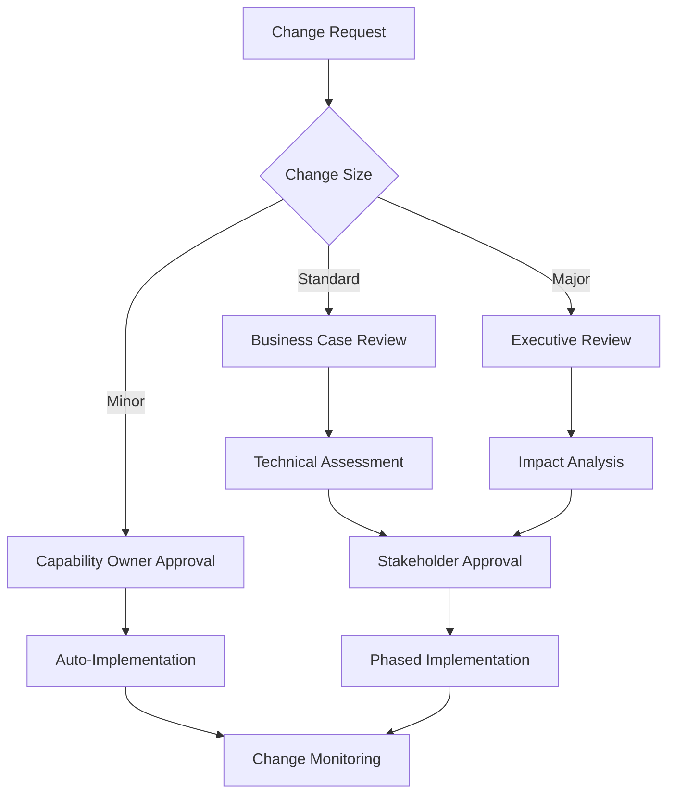

# SLA System Customization

## Overview

The SLA system provides a flexible, hierarchical approach to service level management that balances organizational consistency with team-specific requirements. This guide covers advanced configuration options for system administrators and capability owners who need to customize SLA behavior beyond the default settings.

## SLA Framework Architecture

### Hierarchical SLA Resolution

The system employs a **hierarchical fallback mechanism** for SLA target resolution, ensuring every ticket has an appropriate SLA target:

1. **Service-Specific SLA Overrides** (highest priority)
   - Fine-grained SLAs for specific services within capabilities
   - Example: "Critical Data Extract" vs. "Standard Data Extract"

2. **Capability-Level SLA Targets** (second priority)
   - Team-defined SLAs that override system defaults
   - Configured by capability owners based on business commitments

3. **Default SLA Table Values** (third priority)
   - Fallback SLAs for all ticket types
   - Ensures coverage during configuration transitions

4. **Ultimate Fallback** (last resort)
   - 5-day default prevents calculation failures
   - Applied when all other sources are unavailable

### Technical Implementation

```dax
// Complete hierarchical SLA resolution with error handling
SLA_Target_Days_Hierarchical = 
VAR ServiceSLA = 
    CALCULATE(
        MAX(Dim_Service[ServiceResponseTimeTarget]),
        RELATED(Dim_Service[ServiceResponseTimeTarget]) <> BLANK()
    )
VAR CapabilitySLA = 
    CALCULATE(
        RELATED(Dim_Capability[ResponseTimeTargetDays]),
        USERELATIONSHIP(
            Fact_Ticket_Summary[issue_type], 
            Config_Issue_Type_Capability_Mapping[IssueType]
        )
    )
VAR DefaultSLA = 
    CALCULATE(
        MAX(Default_SLA_Table[SLA_Days]),
        USERELATIONSHIP(Fact_Ticket_Summary[issue_type], Default_SLA_Table[TicketType]),
        Default_SLA_Table[IsActive] = TRUE
    )
RETURN COALESCE(ServiceSLA, CapabilitySLA, DefaultSLA, 5)
```

## Default SLA Configuration

### Default SLA Table Structure

The Default SLA Table serves as the foundation for SLA management across the organization:

| Field Name | Data Type | Purpose |
|------------|-----------|---------|
| `TicketType` | Text | Jira issue type (business key) |
| `SLA_Days` | Number | Default SLA target in business days |
| `DefaultCriticality` | Text | Standard criticality level |
| `ExcludeWeekends` | Boolean | Weekend exclusion flag |
| `BusinessDaysOnly` | Boolean | Business days calculation flag |
| `Notes` | Text | Business context and justification |

### Standard Default Values

| Ticket Type | SLA Days | Criticality | Business Justification |
|-------------|----------|-------------|------------------------|
| **Bug** | 3 | High | Critical defects require faster response |
| **Task** | 5 | Standard | Standard business day response target |
| **Story** | 8 | Standard | User stories standard processing |
| **Epic** | 10 | Medium | Large initiatives allow longer response time |
| **Sub-task** | 2 | Standard | Quick components support |
| **Incident** | 1 | Critical | Production incidents highest priority |
| **Service Request** | 5 | Standard | Standard service delivery |
| **Change Request** | 10 | Medium | Change management process |
| **Improvement** | 7 | Medium | Enhancement requests |
| **New Feature** | 15 | Low | Extended analysis time required |

### Data Source Options

**Static Implementation (Development/Phase 0)**
```m
// Embedded in Power BI for development and testing
let
    Source = #table(
        {"TicketType", "SLA_Days", "DefaultCriticality", "ExcludeWeekends", "Notes"},
        {
            {"Bug", 3, "High", true, "Critical defects require faster response"},
            {"Task", 5, "Standard", true, "Standard business day response target"},
            {"Epic", 10, "Medium", true, "Large initiatives allow longer response time"},
            {"Incident", 1, "Critical", false, "24/7 support for production issues"},
            {"Story", 8, "Standard", true, "User stories standard processing"}
        }
    ),
    AddMetadata = Table.AddColumn(Source, "IsActive", each true),
    AddTimestamp = Table.AddColumn(AddMetadata, "CreatedDate", each Date.From(DateTime.LocalNow()))
in
    AddTimestamp
```

**SharePoint List (Production)**
```m
// Collaborative editing with version control
let
    Source = SharePoint.Tables("https://company.sharepoint.com/sites/DataTeam"),
    SLA_List = Source{[Name="Default_SLA_Configuration"]}[Items],
    
    // Handle SharePoint column formatting
    RenameColumns = Table.RenameColumns(SLA_List, {
        {"Title", "TicketType"},
        {"SLA_x0020_Days", "SLA_Days"}
    }),
    
    // Data validation and type conversion
    FilterActive = Table.SelectRows(RenameColumns, each [IsActive] = true),
    ValidateData = Table.TransformColumns(FilterActive, {
        {"SLA_Days", each try Number.From(_) otherwise 5},
        {"ExcludeWeekends", each try Logical.From(_) otherwise true}
    })
in
    ValidateData
```

**Hybrid Implementation (Enterprise)**
```m
// Multiple source fallback for maximum reliability
let
    LoadedData = List.First(
        List.RemoveNulls({
            TryLoadSharePoint(),    // Primary source
            TryLoadDatabase(),      // Secondary source
            TryLoadExcel(),         // Tertiary source
            GetStaticFallback()     // Last resort
        })
    ),
    
    StandardizedData = Table.RenameColumns(LoadedData, {
        {"Title", "TicketType"}
    }, MissingField.Ignore)
in
    StandardizedData
```

## Custom SLA Implementation

### Service-Specific SLA Configuration

Service-specific SLAs provide the finest level of customization:

**Configuration Process:**
1. **Identify Service Requirements**
   - Analyze historical performance
   - Consider customer commitments
   - Evaluate resource constraints

2. **Set Override Values**
   - Configure in `Dim_Service[ServiceResponseTimeTarget]`
   - Document business justification
   - Obtain stakeholder approval

3. **Validate Implementation**
   - Test SLA resolution logic
   - Verify calculations with sample data
   - Monitor initial performance

**Example Service Overrides:**
```sql
-- Service-specific overrides example
SERVICE_KEY               | SERVICE_SLA_DAYS | JUSTIFICATION
"DQ-CRITICAL-VALIDATION" | 1               | Regulatory compliance requirement
"DE-BULK-EXTRACT"        | 7               | Large volume processing time
"CC-EMERGENCY-CHANGE"    | 0.5             | Critical system fixes
```

### Capability-Level Customization

Capability owners can establish team-specific SLA targets:

**Configuration Authority:**
- Capability owners have approval authority for their team's SLAs
- Changes require business justification
- Impact assessment mandatory for significant changes

**Configuration Process:**
1. **Baseline Analysis**
   - Review 6-month historical performance
   - Identify capability-specific factors
   - Consider workload characteristics

2. **Target Setting**
   - Set realistic, achievable targets
   - Align with customer expectations
   - Balance stretch goals with attainability

3. **Implementation**
   - Update `Dim_Capability[ResponseTimeTargetDays]`
   - Communicate changes to stakeholders
   - Monitor post-implementation performance

### Business Day Calculations

**Standard Business Hours:**
- **Monday - Friday**: 9:00 AM to 5:00 PM (local time)
- **Weekends**: Excluded by default (configurable per ticket type)
- **Holidays**: Corporate holiday calendar integration
- **Time Zone**: UTC standardization with local display

### Advanced Business Day Logic

**Power Query Implementation:**
```m
// Complete business hours calculation with holiday support
AddDurationBusiness = Table.AddColumn(AddDurationCalendar, "DurationBusinessHours", each
    let
        StartTime = [PreviousChangeTime],
        EndTime = [change_created],
        StartDate = Date.From(StartTime),
        EndDate = Date.From(EndTime),
        
        // Generate date range
        DateList = List.Dates(StartDate, Duration.Days(EndDate - StartDate) + 1, #duration(1,0,0,0)),
        
        // Filter for business days (exclude weekends and holidays)
        BusinessDays = List.Select(DateList, each 
            Date.DayOfWeek(_, Day.Monday) < 5 and  // Monday=0, Friday=4
            not List.Contains(HolidayCalendar[Date], _)
        ),
        
        // Calculate business hours for each day
        BusinessHours = List.Accumulate(BusinessDays, 0, (total, current) =>
            if current = StartDate and current = EndDate then
                // Same day calculation (consider business hours 9-17)
                let 
                    ActualStart = Time.Max(DateTime.Time(StartTime), #time(9,0,0)),
                    ActualEnd = Time.Min(DateTime.Time(EndTime), #time(17,0,0))
                in Duration.TotalHours(ActualEnd - ActualStart)
            else if current = StartDate then
                // First day - from start time to end of business day
                let ActualStart = Time.Max(DateTime.Time(StartTime), #time(9,0,0))
                in Duration.TotalHours(#time(17,0,0) - ActualStart)
            else if current = EndDate then
                // Last day - from start of business day to end time  
                let ActualEnd = Time.Min(DateTime.Time(EndTime), #time(17,0,0))
                in total + Duration.TotalHours(ActualEnd - #time(9,0,0))
            else
                // Full business day (8 hours)
                total + 8
        )
    in
        Number.Max(BusinessHours, 0)  // Ensure non-negative
)
```

**Custom Business Rules Examples:**

1. **24/7 Operations (Incident Management)**
```m
// No weekend/holiday exclusions for critical incidents
ExcludeWeekends = if [issue_type] = "Incident" then false else true
```

2. **Extended Hours (Development Teams)**
```m
// 10-hour business days for development work
BusinessHoursPerDay = if [capability_key] = "DEV" then 10 else 8
```

3. **Regional Variations**
```m
// Different business hours by region
BusinessHours = switch [assignee_region]
    case "APAC" then {start: #time(8,0,0), end: #time(16,0,0)}
    case "EMEA" then {start: #time(9,0,0), end: #time(17,0,0)} 
    case "AMER" then {start: #time(9,0,0), end: #time(17,0,0)}
    otherwise {start: #time(9,0,0), end: #time(17,0,0)}
```

### Holiday Calendar Configuration

**Implementation Options:**
1. **Static List**: Hardcoded holiday dates
2. **Dynamic Calendar**: Integration with corporate calendar systems
3. **Regional Calendars**: Multiple holiday calendars by location

## SLA Performance Measurement

### Core Calculation Logic

**ResolutionTimeDays Implementation:**
```dax
ResolutionTimeDays = 
VAR CreatedDate = Fact_Ticket_Summary[created]
VAR ResolvedDate = Fact_Ticket_Summary[resolution_date]
VAR CalculationResult = 
    DATEDIFF(
        CreatedDate,
        COALESCE(ResolvedDate, NOW()),
        DAY
    )
RETURN 
    MAX(CalculationResult, 0)  // Ensure non-negative values
```

**Met_SLA Logic:**
```dax
Met_SLA = 
VAR ActualResolutionDays = Fact_Ticket_Summary[ResolutionTimeDays]
VAR IsResolved = Fact_Ticket_Summary[resolution_date] <> BLANK()
VAR SLA_Target = [SLA_Target_Days_Hierarchical]

RETURN 
    SWITCH(
        TRUE(),
        NOT IsResolved, BLANK(),                    // Cannot determine yet
        ActualResolutionDays <= SLA_Target, TRUE,  // Met SLA
        ActualResolutionDays > SLA_Target, FALSE   // Missed SLA
    )
```

### Performance Scoring Methods

**Variance Calculations:**
```dax
SLA_Variance_Days = 
    [ResolutionTimeDays] - [SLA_Target_Days]

SLA_Performance_Score = 
    IF(
        [SLA_Target_Days] > 0,
        ([SLA_Target_Days] / [ResolutionTimeDays]) * 100,
        BLANK()
    )
```

**Trend Analysis:**
- **Monthly SLA Achievement**: Rolling averages for stability
- **Performance Distribution**: Percentile analysis (P50, P90, P95)
- **Capability Benchmarking**: Cross-team performance comparison

## Advanced Features

### Dynamic SLA Targets

**Seasonal Adjustments:**
- **Holiday Periods**: Extended SLAs during reduced staffing
- **Year-End Closures**: Adjusted targets for business cycles
- **Peak Periods**: Modified SLAs during high-volume times

**Workload-Based Targets:**
- **Volume Scaling**: SLAs adjust based on ticket volume
- **Complexity Factors**: Different SLAs for complex vs. simple requests
- **Resource Availability**: SLA adjustments based on staffing levels

### Exception Handling

**Emergency Ticket Classification:**
- **Critical Priority Override**: Shortened SLAs for P1 incidents
- **Special Issue Types**: Unique SLA rules for specific scenarios
- **Escalation Triggers**: Automatic escalation before SLA breach

**Configuration Example:**
```sql
-- Priority-based SLA adjustments
CASE 
    WHEN priority = 'P1' THEN base_sla * 0.25  -- 75% reduction
    WHEN priority = 'P2' THEN base_sla * 0.5   -- 50% reduction
    WHEN priority = 'P3' THEN base_sla * 1.0   -- No change
    WHEN priority = 'P4' THEN base_sla * 1.5   -- 50% extension
END
```

## Configuration Management

### Change Control Process

**SLA Change Categories:**

1. **Minor Changes** (< 10% adjustment)
   - Capability owner approval only
   - Automatic implementation
   - Monthly review in governance meetings

2. **Standard Changes** (10-25% adjustment)
   - Business justification required
   - Technical impact assessment
   - Cross-functional review and approval

3. **Major Changes** (> 25% adjustment)
   - Executive approval required
   - Comprehensive impact analysis
   - Phased implementation with monitoring

**Change Request Workflow:**



### Comprehensive Change Tracking

**Audit Trail Requirements:**
```sql
-- Complete change audit logging
INSERT INTO Config_Change_Audit_Log (
    change_source,
    change_type, 
    table_name,
    record_key,
    old_values,
    new_values,
    changed_by_user_id,
    change_reason,
    business_justification,
    approval_status,
    risk_level
) VALUES (
    'SLA_CONFIGURATION',
    'UPDATE',
    'Dim_Capability',
    capability_key,
    JSON_OBJECT('ResponseTimeTargetDays', old_sla),
    JSON_OBJECT('ResponseTimeTargetDays', new_sla),
    user_id,
    'SLA target adjustment based on performance analysis',
    'Historical 90% achievement rate allows for 20% reduction',
    'APPROVED',
    CASE WHEN ABS(new_sla - old_sla) / old_sla > 0.25 THEN 'HIGH' ELSE 'MEDIUM' END
);
```

**Change Impact Monitoring:**
```dax
// Pre/post change performance analysis
SLA_Change_Impact_Analysis = 
VAR ChangeDate = [Selected_Change_Date]
VAR PreChangePeriod = 
    CALCULATE(
        [SLO_Achievement_Rate],
        Fact_Ticket_Summary[ResolvedDate] >= ChangeDate - 30,
        Fact_Ticket_Summary[ResolvedDate] < ChangeDate
    )
VAR PostChangePeriod = 
    CALCULATE(
        [SLO_Achievement_Rate],
        Fact_Ticket_Summary[ResolvedDate] >= ChangeDate,
        Fact_Ticket_Summary[ResolvedDate] < ChangeDate + 30
    )
VAR ImpactMagnitude = PostChangePeriod - PreChangePeriod
VAR ImpactSignificance = 
    IF(ABS(ImpactMagnitude) > 5, "Significant", 
       IF(ABS(ImpactMagnitude) > 2, "Moderate", "Minor"))
RETURN 
    "Performance Change: " & FORMAT(ImpactMagnitude, "+0.0%;-0.0%") & 
    " (" & ImpactSignificance & ")"
```

### Audit and Tracking

**Change Documentation:**
- **Configuration Changes**: Before/after values
- **Business Justification**: Rationale for changes
- **Approval Records**: Who approved and when
- **Impact Assessment**: Measured effects post-implementation

**Monitoring Changes:**
```dax
SLA_Change_Impact_Analysis = 
VAR PreChangePerformance = 
    CALCULATE(
        [SLO_Achievement_Rate],
        Fact_Ticket_Summary[ResolvedDate] < [SLA_Change_Date]
    )
VAR PostChangePerformance = 
    CALCULATE(
        [SLO_Achievement_Rate],
        Fact_Ticket_Summary[ResolvedDate] >= [SLA_Change_Date]
    )
RETURN PostChangePerformance - PreChangePerformance
```

## Validation and Testing

### Comprehensive Testing Framework

**Test Case Categories:**

1. **Unit Tests** (Individual Calculation Validation)
```dax
// Validate basic SLA calculation for known scenarios
Test_Basic_SLA_Calculation = 
VAR TestTickets = 
    FILTER(
        Fact_Ticket_Summary,
        [key] IN {"TEST-001", "TEST-002", "TEST-003"}
    )
VAR ValidationResults = 
    ADDCOLUMNS(
        TestTickets,
        "Expected_SLA_Days", 
            SWITCH([key], 
                "TEST-001", 3,  // Bug with 3-day SLA
                "TEST-002", 5,  // Task with 5-day SLA  
                "TEST-003", 1,  // Incident with 1-day SLA
                BLANK()
            ),
        "Actual_SLA_Days", [SLA_Target_Days_Hierarchical],
        "Test_Result", [Expected_SLA_Days] = [Actual_SLA_Days]
    )
RETURN ValidationResults
```

2. **Integration Tests** (End-to-End SLA Resolution)
```dax
// Test hierarchical SLA resolution across all levels
Test_SLA_Hierarchy = 
VAR TestScenarios = 
    DATATABLE(
        "Scenario", STRING,
        "TicketType", STRING, 
        "HasServiceSLA", BOOLEAN,
        "HasCapabilitySLA", BOOLEAN,
        "ExpectedSource", STRING,
        {
            {"Service Override", "Bug", TRUE, TRUE, "Service"},
            {"Capability Fallback", "Task", FALSE, TRUE, "Capability"}, 
            {"Default Fallback", "New_Type", FALSE, FALSE, "Default"},
            {"Ultimate Fallback", "Unknown", FALSE, FALSE, "Ultimate"}
        }
    )
VAR ValidationResults = 
    ADDCOLUMNS(
        TestScenarios,
        "Actual_SLA_Source", [Current_SLA_Source_Function],
        "Test_Passed", [ExpectedSource] = [Actual_SLA_Source]
    )
RETURN ValidationResults
```

3. **Performance Tests** (Load and Efficiency)
```dax
// Measure SLA calculation performance under load
Performance_Benchmark = 
VAR StartTime = NOW()
VAR TestResult = 
    SUMMARIZE(
        Fact_Ticket_Summary,
        [issue_type],
        "SLA_Achievement", [SLO_Achievement_Rate],
        "Avg_SLA_Days", AVERAGE([SLA_Target_Days_Hierarchical])
    )
VAR EndTime = NOW() 
VAR ExecutionTimeSeconds = DATEDIFF(StartTime, EndTime, SECOND)
VAR RowsProcessed = COUNTROWS(Fact_Ticket_Summary)
RETURN 
    "Processed " & FORMAT(RowsProcessed, "#,0") & " rows in " & 
    ExecutionTimeSeconds & " seconds (" & 
    FORMAT(RowsProcessed / ExecutionTimeSeconds, "#,0") & " rows/sec)"
```

### Business Validation Scenarios

**Edge Case Testing:**
- **Weekend Boundaries**: Tickets created/resolved on weekends
- **Holiday Periods**: SLA calculations during holidays  
- **Timezone Edges**: Cross-timezone ticket handling
- **Year Boundaries**: December-January ticket transitions
- **Data Quality**: Handling of null/invalid dates

**Business Rule Validation:**
```sql
-- Comprehensive business rule testing
WITH ValidationTests AS (
    SELECT 
        ticket_key,
        issue_type,
        created_date,
        resolution_date,
        -- Manual calculation for comparison
        CASE 
            WHEN DATENAME(dw, created_date) IN ('Saturday', 'Sunday') 
            THEN 'Weekend Creation Test'
            WHEN resolution_date IS NULL 
            THEN 'Open Ticket Test'
            WHEN DATEDIFF(day, created_date, resolution_date) = 0
            THEN 'Same Day Resolution Test'
            ELSE 'Standard Test'
        END as test_category,
        -- Expected vs actual comparison
        manual_sla_calculation,
        system_sla_calculation,
        ABS(manual_sla_calculation - system_sla_calculation) as variance
    FROM ticket_test_dataset
)
SELECT 
    test_category,
    COUNT(*) as test_count,
    AVG(variance) as avg_variance,
    MAX(variance) as max_variance,
    SUM(CASE WHEN variance = 0 THEN 1 ELSE 0 END) * 100.0 / COUNT(*) as accuracy_pct
FROM ValidationTests
GROUP BY test_category;
```

### Performance Testing

**Load Testing:**
- **Large Dataset Performance**: SLA calculations with 100k+ tickets
- **Real-Time Calculation**: Interactive dashboard response times
- **Refresh Performance**: Nightly data update efficiency

**Accuracy Validation:**
```dax
SLA_Validation_Summary = 
VAR TestCases = 100  // Sample size
VAR AccuratePredictions = 
    SUMX(
        TOPN(TestCases, Fact_Ticket_Summary, [ResolutionTimeDays]),
        IF([Manual_SLA_Check] = [Met_SLA], 1, 0)
    )
RETURN DIVIDE(AccuratePredictions, TestCases) * 100  // Accuracy percentage
```

## Implementation Best Practices

### Strategic Planning

**Implementation Phases:**
1. **Assessment Phase** (Week 1-2)
   - Current state analysis
   - Historical performance review
   - Stakeholder requirement gathering
   - Risk assessment and mitigation planning

2. **Configuration Phase** (Week 3-4)  
   - Default SLA table setup
   - Capability-level target configuration
   - Business rule customization
   - Integration with existing workflows

3. **Validation Phase** (Week 5-6)
   - Comprehensive testing execution
   - Business user acceptance testing
   - Performance optimization
   - Documentation completion

4. **Deployment Phase** (Week 7-8)
   - Phased rollout to capability teams
   - Training and change management
   - Monitoring and adjustment
   - Success criteria validation

### Configuration Guidelines

**SLA Target Setting Best Practices:**
- **Data-Driven Approach**: Base targets on 80th percentile of historical performance
- **Realistic Aspirations**: Set achievable targets that drive improvement
- **Business Alignment**: Ensure SLAs reflect actual business commitments
- **Continuous Calibration**: Plan quarterly reviews and adjustments

**Common Configuration Patterns:**
```sql
-- Priority-based SLA matrix (recommended starting point)
ticket_type     | P1_days | P2_days | P3_days | P4_days | rationale
"Incident"      | 0.5     | 1       | 2       | 3       | Production impact severity
"Bug"           | 1       | 2       | 3       | 5       | Defect urgency scaling  
"Task"          | 2       | 3       | 5       | 7       | Standard work items
"Story"         | 3       | 5       | 8       | 10      | Feature development
"Epic"          | 5       | 7       | 10      | 15      | Large initiatives
```

### Avoiding Common Pitfalls

**Implementation Anti-Patterns:**

1. **The Perfectionist Trap**
   - *Problem*: Waiting for perfect configuration before go-live
   - *Solution*: Start with good defaults, iterate based on real data

2. **The Gaming Problem**
   - *Problem*: Teams manipulating metrics instead of improving service
   - *Solution*: Focus on customer outcomes, not just metric achievement

3. **The Comparison Trap**
   - *Problem*: Inappropriate cross-capability comparisons
   - *Solution*: Context-aware benchmarking with normalization factors

4. **The Change Fatigue Issue**
   - *Problem*: Constant SLA adjustments creating instability
   - *Solution*: Quarterly change windows with stability periods

**Technical Pitfalls:**
- **Calculation Errors**: Validate business day logic thoroughly
- **Performance Issues**: Monitor calculation impact on dashboard refresh
- **Data Quality**: Implement robust error handling for edge cases
- **Integration Failures**: Test all system connections before production

### Success Metrics and KPIs

**Implementation Success Indicators:**

1. **Technical Metrics**
   - SLA calculation accuracy: >99%
   - Dashboard load time: <3 seconds
   - Data refresh reliability: >99.9%
   - Zero calculation errors in production

2. **Business Metrics**
   - SLA achievement improvement: 10-15% within 6 months
   - Stakeholder adoption rate: >90% within 3 months
   - Configuration change frequency: <2 per quarter per capability
   - User satisfaction scores: >4.5/5

3. **Operational Metrics**
   - Support ticket volume: <5 per month related to SLA issues
   - Training completion rate: 100% for capability owners
   - Configuration accuracy: No rollbacks due to errors
   - Change approval cycle time: <5 business days average

### Long-Term Maintenance Strategy

**Quarterly Review Process:**
1. **Performance Analysis**
   - SLA achievement trends
   - Cross-capability benchmarking
   - Seasonal variation assessment
   - Capacity planning implications

2. **Configuration Health Check**
   - SLA target appropriateness
   - Business rule relevance
   - Integration stability
   - User feedback incorporation

3. **Strategic Alignment**
   - Business priority shifts
   - Customer expectation changes
   - Technology capability updates
   - Organizational transformation impact

---

## Next Steps

For implementation support:
- **Technical Questions**: Contact the Power BI development team
- **Business Configuration**: Work with your capability owner
- **Advanced Features**: Engage with the data architecture team
- **Training**: Attend monthly SLA configuration workshops

*This customization guide enables sophisticated SLA management while maintaining system simplicity and organizational consistency.*