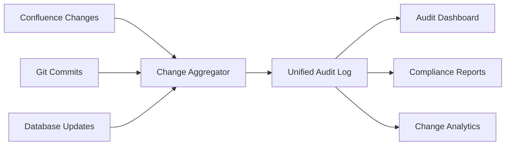

# Comprehensive Change Tracking and Audit System

## Overview

This change tracking system provides complete visibility into all SLO configuration modifications across multiple sources (Confluence, Git, Database). It captures who made changes, when they were made, what was modified, and provides transparent audit logs for compliance and operational oversight.

## Change Tracking Architecture

### Multi-Source Change Capture



---

## 1. Unified Change Log Schema

### Primary Audit Tables

#### Config_Change_Audit_Log
```sql
CREATE TABLE Config_Change_Audit_Log (
    -- Primary Key
    audit_id                    BIGINT IDENTITY(1,1) PRIMARY KEY,
    
    -- Change Identity
    change_id                   UNIQUEIDENTIFIER NOT NULL DEFAULT NEWID(),
    change_source               NVARCHAR(20) NOT NULL, -- 'CONFLUENCE', 'GIT', 'DATABASE', 'API'
    change_type                 NVARCHAR(20) NOT NULL, -- 'INSERT', 'UPDATE', 'DELETE', 'ROLLBACK'
    operation_type              NVARCHAR(50), -- 'BATCH_IMPORT', 'MANUAL_EDIT', 'AUTO_SYNC', 'EMERGENCY_ROLLBACK'
    
    -- What Changed
    table_name                  NVARCHAR(100) NOT NULL,
    record_key                  NVARCHAR(100) NOT NULL, -- Business key of changed record
    capability_key              NVARCHAR(20),
    service_key                 NVARCHAR(50),
    
    -- Change Details
    changed_fields              NVARCHAR(MAX), -- JSON array of field names
    old_values                  NVARCHAR(MAX), -- JSON object with old values
    new_values                  NVARCHAR(MAX), -- JSON object with new values
    change_summary              NVARCHAR(500), -- Human-readable change description
    
    -- Who Made the Change
    changed_by_user_id          NVARCHAR(100),
    changed_by_display_name     NVARCHAR(200),
    changed_by_email            NVARCHAR(200),
    changed_by_type             NVARCHAR(20), -- 'HUMAN', 'SERVICE_ACCOUNT', 'SYSTEM'
    
    -- When
    change_timestamp            DATETIME2 NOT NULL DEFAULT GETDATE(),
    change_timezone             NVARCHAR(50) DEFAULT 'UTC',
    
    -- Source Context
    source_system_id            NVARCHAR(100), -- Confluence page ID, Git commit hash, etc.
    source_version              NVARCHAR(50), -- Confluence version, Git commit, batch ID
    source_url                  NVARCHAR(500), -- Link back to source
    extraction_batch_id         UNIQUEIDENTIFIER,
    
    -- Business Context
    change_reason               NVARCHAR(500),
    business_justification      NVARCHAR(1000),
    approval_status             NVARCHAR(20), -- 'APPROVED', 'PENDING', 'REJECTED', 'AUTO_APPROVED'
    approved_by                 NVARCHAR(100),
    approved_timestamp          DATETIME2,
    
    -- Impact Assessment
    impacted_services           NVARCHAR(MAX), -- JSON array of affected services
    risk_level                  NVARCHAR(20), -- 'LOW', 'MEDIUM', 'HIGH', 'CRITICAL'
    rollback_available          BIT DEFAULT 1,
    rollback_target_id          UNIQUEIDENTIFIER,
    
    -- Metadata
    session_id                  NVARCHAR(100), -- User session identifier
    ip_address                  NVARCHAR(45),
    user_agent                  NVARCHAR(500),
    api_client                  NVARCHAR(100),
    correlation_id              UNIQUEIDENTIFIER, -- Groups related changes
    
    -- Compliance
    retention_policy            NVARCHAR(50) DEFAULT 'STANDARD_7_YEARS',
    classification              NVARCHAR(20) DEFAULT 'INTERNAL', -- 'PUBLIC', 'INTERNAL', 'CONFIDENTIAL'
    
    -- Constraints and Indexes
    INDEX IX_Change_Audit_Timestamp (change_timestamp DESC),
    INDEX IX_Change_Audit_User (changed_by_user_id, change_timestamp),
    INDEX IX_Change_Audit_Capability (capability_key, change_timestamp),
    INDEX IX_Change_Audit_Source (change_source, source_system_id),
    INDEX IX_Change_Audit_Correlation (correlation_id) WHERE correlation_id IS NOT NULL
);
```

#### Config_Field_Change_Detail
```sql
CREATE TABLE Config_Field_Change_Detail (
    -- Primary Key
    detail_id                   BIGINT IDENTITY(1,1) PRIMARY KEY,
    
    -- Link to main audit record
    audit_id                    BIGINT NOT NULL,
    
    -- Field-level details
    field_name                  NVARCHAR(100) NOT NULL,
    field_display_name          NVARCHAR(200),
    field_type                  NVARCHAR(50), -- 'STRING', 'NUMBER', 'DATE', 'BOOLEAN', 'JSON'
    
    -- Old and new values
    old_value                   NVARCHAR(MAX),
    new_value                   NVARCHAR(MAX),
    old_value_display           NVARCHAR(500), -- Formatted for display
    new_value_display           NVARCHAR(500), -- Formatted for display
    
    -- Change characteristics
    change_type_detail          NVARCHAR(20), -- 'VALUE_CHANGE', 'ADDITION', 'REMOVAL', 'TYPE_CHANGE'
    is_sensitive                BIT DEFAULT 0, -- Flag sensitive fields
    validation_impact           NVARCHAR(200), -- How this field affects validation
    
    -- Business impact
    field_criticality           NVARCHAR(20), -- 'LOW', 'MEDIUM', 'HIGH', 'CRITICAL'
    business_meaning            NVARCHAR(300), -- What this field represents
    
    FOREIGN KEY (audit_id) REFERENCES Config_Change_Audit_Log(audit_id),
    INDEX IX_Field_Change_Audit (audit_id),
    INDEX IX_Field_Change_Name (field_name, audit_id)
);
```

#### Config_Change_Impact_Analysis
```sql
CREATE TABLE Config_Change_Impact_Analysis (
    -- Primary Key
    impact_id                   BIGINT IDENTITY(1,1) PRIMARY KEY,
    
    -- Link to change
    audit_id                    BIGINT NOT NULL,
    change_id                   UNIQUEIDENTIFIER NOT NULL,
    
    -- Impact details
    impact_type                 NVARCHAR(50), -- 'SLO_TARGET_CHANGE', 'WORKFLOW_MODIFICATION', 'SERVICE_DISRUPTION'
    impact_scope                NVARCHAR(50), -- 'SINGLE_SERVICE', 'CAPABILITY', 'ORGANIZATION'
    impact_description          NVARCHAR(500),
    
    -- Affected entities
    affected_capabilities       NVARCHAR(MAX), -- JSON array
    affected_services           NVARCHAR(MAX), -- JSON array
    affected_kpis               NVARCHAR(MAX), -- JSON array
    
    -- Quantified impact
    estimated_ticket_count      INT, -- Tickets that could be affected
    historical_slo_performance  DECIMAL(5,2), -- Previous SLO performance
    projected_slo_impact        DECIMAL(5,2), -- Expected SLO impact
    
    -- Timeline
    impact_effective_date       DATETIME2,
    impact_assessment_date      DATETIME2 DEFAULT GETDATE(),
    assessed_by                 NVARCHAR(100),
    
    FOREIGN KEY (audit_id) REFERENCES Config_Change_Audit_Log(audit_id),
    INDEX IX_Impact_Analysis_Change (change_id),
    INDEX IX_Impact_Analysis_Scope (impact_scope, impact_effective_date)
);
```

---

## 2. Change Capture Mechanisms

### Confluence Change Tracking

```python
class ConfluenceChangeTracker:
    def __init__(self, confluence_client, db_connection, user_resolver):
        self.confluence = confluence_client
        self.db_connection = db_connection
        self.user_resolver = user_resolver
        
    def track_page_changes(self, page_id: str, old_version: int = None, new_version: int = None):
        """Track changes when Confluence page is updated"""
        
        # Get current and previous versions
        current_page = self.confluence.get_page_by_id(page_id, expand='body.storage,version,history.lastUpdated')
        
        if old_version:
            previous_page = self.confluence.get_page_by_id(page_id, version=old_version, expand='body.storage,version')
        else:
            # Get previous version from history
            history = self.confluence.get_page_version_history(page_id, limit=2)
            if len(history) > 1:
                previous_page = self.confluence.get_page_by_id(page_id, version=history[1]['version']['number'], expand='body.storage,version')
            else:
                previous_page = None
        
        # Extract configurations from both versions
        capability_key = self._extract_capability_key(current_page['title'])
        current_config = self._extract_config_from_page(current_page)
        previous_config = self._extract_config_from_page(previous_page) if previous_page else {}
        
        # Generate change records for each configuration type
        change_records = []
        
        # Track SLO target changes
        slo_changes = self._compare_slo_configs(
            previous_config.get('slo_targets', []),
            current_config.get('slo_targets', []),
            capability_key
        )
        change_records.extend(slo_changes)
        
        # Track service changes
        service_changes = self._compare_service_configs(
            previous_config.get('services', []),
            current_config.get('services', []),
            capability_key
        )
        change_records.extend(service_changes)
        
        # Track issue mapping changes
        mapping_changes = self._compare_mapping_configs(
            previous_config.get('issue_mappings', []),
            current_config.get('issue_mappings', []),
            capability_key
        )
        change_records.extend(mapping_changes)
        
        # Track status rule changes
        status_changes = self._compare_status_configs(
            previous_config.get('status_rules', []),
            current_config.get('status_rules', []),
            capability_key
        )
        change_records.extend(status_changes)
        
        # Resolve user information
        user_info = self._resolve_confluence_user(current_page['version']['by'])
        
        # Create audit records
        correlation_id = str(uuid.uuid4())
        for change_record in change_records:
            self._create_audit_record(
                change_record=change_record,
                user_info=user_info,
                page_info=current_page,
                correlation_id=correlation_id,
                capability_key=capability_key
            )
        
        return {
            'changes_tracked': len(change_records),
            'correlation_id': correlation_id,
            'capability_key': capability_key
        }
    
    def _compare_slo_configs(self, old_slos: List[Dict], new_slos: List[Dict], capability_key: str) -> List[Dict]:
        """Compare SLO configurations and generate change records"""
        
        changes = []
        
        # Create lookup dictionaries
        old_slo_dict = {slo['kpi_name']: slo for slo in old_slos}
        new_slo_dict = {slo['kpi_name']: slo for slo in new_slos}
        
        # Find changes, additions, and deletions
        all_kpis = set(old_slo_dict.keys()) | set(new_slo_dict.keys())
        
        for kpi_name in all_kpis:
            old_slo = old_slo_dict.get(kpi_name)
            new_slo = new_slo_dict.get(kpi_name)
            
            if old_slo and new_slo:
                # Check for modifications
                field_changes = []
                old_values = {}
                new_values = {}
                
                for field in ['target_days', 'criticality', 'business_justification']:
                    old_val = old_slo.get(field)
                    new_val = new_slo.get(field)
                    
                    if old_val != new_val:
                        field_changes.append(field)
                        old_values[field] = old_val
                        new_values[field] = new_val
                
                if field_changes:
                    changes.append({
                        'table_name': 'Config_Capability_SLO',
                        'record_key': f"{capability_key}#{kpi_name}",
                        'change_type': 'UPDATE',
                        'changed_fields': field_changes,
                        'old_values': old_values,
                        'new_values': new_values,
                        'change_summary': f"Updated {kpi_name} SLO: {', '.join(field_changes)}"
                    })
                    
            elif not old_slo and new_slo:
                # New SLO added
                changes.append({
                    'table_name': 'Config_Capability_SLO',
                    'record_key': f"{capability_key}#{kpi_name}",
                    'change_type': 'INSERT',
                    'changed_fields': list(new_slo.keys()),
                    'old_values': {},
                    'new_values': new_slo,
                    'change_summary': f"Added new {kpi_name} SLO"
                })
                
            elif old_slo and not new_slo:
                # SLO removed
                changes.append({
                    'table_name': 'Config_Capability_SLO',
                    'record_key': f"{capability_key}#{kpi_name}",
                    'change_type': 'DELETE',
                    'changed_fields': list(old_slo.keys()),
                    'old_values': old_slo,
                    'new_values': {},
                    'change_summary': f"Removed {kpi_name} SLO"
                })
        
        return changes
    
    def _create_audit_record(self, change_record: Dict, user_info: Dict, page_info: Dict, 
                            correlation_id: str, capability_key: str):
        """Create audit record in database"""
        
        # Calculate risk level based on change type and fields
        risk_level = self._assess_change_risk(change_record)
        
        # Prepare audit record
        audit_data = {
            'change_id': str(uuid.uuid4()),
            'change_source': 'CONFLUENCE',
            'change_type': change_record['change_type'],
            'operation_type': 'MANUAL_EDIT',
            'table_name': change_record['table_name'],
            'record_key': change_record['record_key'],
            'capability_key': capability_key,
            'changed_fields': json.dumps(change_record['changed_fields']),
            'old_values': json.dumps(change_record['old_values']),
            'new_values': json.dumps(change_record['new_values']),
            'change_summary': change_record['change_summary'],
            'changed_by_user_id': user_info['user_id'],
            'changed_by_display_name': user_info['display_name'],
            'changed_by_email': user_info['email'],
            'changed_by_type': 'HUMAN',
            'change_timestamp': datetime.fromisoformat(page_info['version']['when'].replace('Z', '+00:00')),
            'source_system_id': page_info['id'],
            'source_version': str(page_info['version']['number']),
            'source_url': f"{self.confluence.base_url}/pages/{page_info['id']}",
            'risk_level': risk_level,
            'correlation_id': correlation_id
        }
        
        # Insert audit record
        cursor = self.db_connection.cursor()
        cursor.execute(self._get_insert_audit_sql(), audit_data)
        
        audit_id = cursor.lastrowid
        
        # Create field-level change details
        self._create_field_change_details(audit_id, change_record)
        
        # Assess and record impact
        self._assess_and_record_impact(audit_id, change_record, capability_key)
        
        self.db_connection.commit()
    
    def _assess_change_risk(self, change_record: Dict) -> str:
        """Assess risk level of configuration change"""
        
        critical_fields = ['target_days', 'kpi_contribution', 'include_in_slo']
        high_impact_changes = ['DELETE', 'INSERT']
        
        # Check for critical field changes
        if any(field in critical_fields for field in change_record['changed_fields']):
            return 'HIGH'
        
        # Check for high-impact change types
        if change_record['change_type'] in high_impact_changes:
            return 'HIGH'
        
        # Check for large SLO target changes
        if 'target_days' in change_record['changed_fields']:
            old_target = change_record['old_values'].get('target_days', 0)
            new_target = change_record['new_values'].get('target_days', 0)
            
            if old_target > 0:
                change_percent = abs(new_target - old_target) / old_target
                if change_percent > 0.5:  # >50% change
                    return 'HIGH'
                elif change_percent > 0.2:  # >20% change
                    return 'MEDIUM'
        
        return 'LOW'
```

### Git Change Tracking

```python
class GitChangeTracker:
    def __init__(self, git_manager, db_connection):
        self.git_manager = git_manager
        self.db_connection = db_connection
        
    def track_git_commits(self, since_commit: str = None):
        """Track changes from Git commits"""
        
        changes_tracked = 0
        
        # Get commits since last tracking
        if since_commit:
            commits = list(self.git_manager.repo.iter_commits(f'{since_commit}..HEAD'))
        else:
            # Get last 50 commits
            commits = list(self.git_manager.repo.iter_commits(max_count=50))
        
        for commit in commits:
            if self._should_track_commit(commit):
                tracked = self._track_single_commit(commit)
                changes_tracked += tracked
        
        return changes_tracked
    
    def _track_single_commit(self, commit) -> int:
        """Track changes from a single Git commit"""
        
        changes_tracked = 0
        
        # Get changed files
        if commit.parents:
            # Compare with parent commit
            diffs = commit.diff(commit.parents[0])
        else:
            # Initial commit - compare with empty
            diffs = commit.diff(NULL_TREE)
        
        # Group changes by capability
        capability_changes = {}
        
        for diff in diffs:
            if diff.a_path and diff.a_path.startswith('capabilities/'):
                capability_key = self._extract_capability_from_path(diff.a_path)
                
                if capability_key not in capability_changes:
                    capability_changes[capability_key] = []
                
                capability_changes[capability_key].append(diff)
        
        # Process changes for each capability
        for capability_key, diffs in capability_changes.items():
            correlation_id = str(uuid.uuid4())
            
            for diff in diffs:
                change_records = self._analyze_file_diff(diff, capability_key, commit)
                
                for change_record in change_records:
                    self._create_git_audit_record(
                        change_record=change_record,
                        commit=commit,
                        correlation_id=correlation_id,
                        capability_key=capability_key
                    )
                    changes_tracked += 1
        
        return changes_tracked
    
    def _analyze_file_diff(self, diff, capability_key: str, commit) -> List[Dict]:
        """Analyze file diff to extract configuration changes"""
        
        changes = []
        
        if diff.new_file:
            # New file added
            changes.append({
                'table_name': self._map_file_to_table(diff.b_path),
                'record_key': f"{capability_key}#{os.path.basename(diff.b_path)}",
                'change_type': 'INSERT',
                'changed_fields': ['file_content'],
                'old_values': {},
                'new_values': {'file_content': diff.b_blob.data_stream.read().decode('utf-8')},
                'change_summary': f"Added new {os.path.basename(diff.b_path)}"
            })
            
        elif diff.deleted_file:
            # File deleted
            changes.append({
                'table_name': self._map_file_to_table(diff.a_path),
                'record_key': f"{capability_key}#{os.path.basename(diff.a_path)}",
                'change_type': 'DELETE',
                'changed_fields': ['file_content'],
                'old_values': {'file_content': diff.a_blob.data_stream.read().decode('utf-8')},
                'new_values': {},
                'change_summary': f"Deleted {os.path.basename(diff.a_path)}"
            })
            
        elif diff.a_blob and diff.b_blob:
            # File modified
            old_content = diff.a_blob.data_stream.read().decode('utf-8')
            new_content = diff.b_blob.data_stream.read().decode('utf-8')
            
            # Parse markdown content to detect specific field changes
            field_changes = self._detect_markdown_field_changes(old_content, new_content, diff.b_path)
            
            if field_changes:
                changes.append({
                    'table_name': self._map_file_to_table(diff.b_path),
                    'record_key': f"{capability_key}#{os.path.basename(diff.b_path)}",
                    'change_type': 'UPDATE',
                    'changed_fields': field_changes['changed_fields'],
                    'old_values': field_changes['old_values'],
                    'new_values': field_changes['new_values'],
                    'change_summary': f"Modified {os.path.basename(diff.b_path)}: {', '.join(field_changes['changed_fields'])}"
                })
        
        return changes
    
    def _detect_markdown_field_changes(self, old_content: str, new_content: str, file_path: str) -> Dict:
        """Detect specific field changes in markdown files"""
        
        # Parse old and new markdown content
        old_data = self._parse_markdown_content(old_content, file_path)
        new_data = self._parse_markdown_content(new_content, file_path)
        
        changed_fields = []
        old_values = {}
        new_values = {}
        
        # Compare configurations
        if 'slo-targets.md' in file_path:
            # SLO targets comparison
            for kpi in set(old_data.keys()) | set(new_data.keys()):
                old_slo = old_data.get(kpi, {})
                new_slo = new_data.get(kpi, {})
                
                for field in ['target_days', 'criticality', 'justification']:
                    if old_slo.get(field) != new_slo.get(field):
                        field_key = f"{kpi}.{field}"
                        changed_fields.append(field_key)
                        old_values[field_key] = old_slo.get(field)
                        new_values[field_key] = new_slo.get(field)
        
        # Similar logic for other file types...
        
        return {
            'changed_fields': changed_fields,
            'old_values': old_values,
            'new_values': new_values
        } if changed_fields else None
    
    def _create_git_audit_record(self, change_record: Dict, commit, correlation_id: str, capability_key: str):
        """Create audit record for Git change"""
        
        # Extract user information from Git commit
        user_info = self._resolve_git_user(commit.author)
        
        # Assess risk level
        risk_level = self._assess_change_risk(change_record)
        
        # Prepare audit record
        audit_data = {
            'change_id': str(uuid.uuid4()),
            'change_source': 'GIT',
            'change_type': change_record['change_type'],
            'operation_type': 'VERSION_CONTROL',
            'table_name': change_record['table_name'],
            'record_key': change_record['record_key'],
            'capability_key': capability_key,
            'changed_fields': json.dumps(change_record['changed_fields']),
            'old_values': json.dumps(change_record['old_values']),
            'new_values': json.dumps(change_record['new_values']),
            'change_summary': change_record['change_summary'],
            'changed_by_user_id': user_info['user_id'],
            'changed_by_display_name': user_info['display_name'],
            'changed_by_email': user_info['email'],
            'changed_by_type': 'HUMAN',
            'change_timestamp': commit.committed_datetime,
            'source_system_id': commit.hexsha,
            'source_version': commit.hexsha[:8],
            'source_url': f"{self.git_manager.remote_url}/commit/{commit.hexsha}",
            'change_reason': commit.message.split('\n')[0],
            'risk_level': risk_level,
            'correlation_id': correlation_id
        }
        
        # Insert audit record
        cursor = self.db_connection.cursor()
        cursor.execute(self._get_insert_audit_sql(), audit_data)
        
        audit_id = cursor.lastrowid
        
        # Create field-level change details
        self._create_field_change_details(audit_id, change_record)
        
        self.db_connection.commit()
```

### Database Change Tracking

```python
class DatabaseChangeTracker:
    def __init__(self, db_connection):
        self.db_connection = db_connection
        
    def create_triggers(self):
        """Create database triggers to track direct configuration changes"""
        
        tables_to_track = [
            'Config_Capability',
            'Config_Service',
            'Config_Issue_Type_Mapping',
            'Config_Status_Rules'
        ]
        
        for table in tables_to_track:
            self._create_audit_trigger(table)
    
    def _create_audit_trigger(self, table_name: str):
        """Create audit trigger for specific table"""
        
        trigger_sql = f"""
        CREATE TRIGGER trg_{table_name}_Audit
        ON {table_name}
        FOR INSERT, UPDATE, DELETE
        AS
        BEGIN
            SET NOCOUNT ON;
            
            DECLARE @operation NVARCHAR(10);
            DECLARE @correlation_id UNIQUEIDENTIFIER = NEWID();
            DECLARE @user_id NVARCHAR(100) = SYSTEM_USER;
            DECLARE @app_name NVARCHAR(128) = APP_NAME();
            
            -- Determine operation type
            IF EXISTS(SELECT * FROM inserted) AND EXISTS(SELECT * FROM deleted)
                SET @operation = 'UPDATE';
            ELSE IF EXISTS(SELECT * FROM inserted)
                SET @operation = 'INSERT';
            ELSE
                SET @operation = 'DELETE';
            
            -- Handle INSERT operations
            IF @operation = 'INSERT'
            BEGIN
                INSERT INTO Config_Change_Audit_Log (
                    change_source, change_type, operation_type, table_name, record_key,
                    capability_key, new_values, change_summary, changed_by_user_id,
                    changed_by_type, source_system_id, correlation_id
                )
                SELECT 
                    'DATABASE',
                    'INSERT',
                    'DIRECT_DATABASE',
                    '{table_name}',
                    {self._get_record_key_expression(table_name)},
                    capability_key,
                    {self._get_json_values_expression(table_name, 'inserted')},
                    'Direct database insert',
                    @user_id,
                    'SYSTEM',
                    @app_name,
                    @correlation_id
                FROM inserted;
            END
            
            -- Handle UPDATE operations
            IF @operation = 'UPDATE'
            BEGIN
                INSERT INTO Config_Change_Audit_Log (
                    change_source, change_type, operation_type, table_name, record_key,
                    capability_key, old_values, new_values, changed_fields, change_summary,
                    changed_by_user_id, changed_by_type, source_system_id, correlation_id
                )
                SELECT 
                    'DATABASE',
                    'UPDATE',
                    'DIRECT_DATABASE',
                    '{table_name}',
                    {self._get_record_key_expression(table_name)},
                    i.capability_key,
                    {self._get_json_values_expression(table_name, 'deleted')},
                    {self._get_json_values_expression(table_name, 'inserted')},
                    {self._get_changed_fields_expression(table_name)},
                    'Direct database update',
                    @user_id,
                    'SYSTEM',
                    @app_name,
                    @correlation_id
                FROM inserted i
                JOIN deleted d ON {self._get_join_condition(table_name)};
            END
            
            -- Handle DELETE operations
            IF @operation = 'DELETE'
            BEGIN
                INSERT INTO Config_Change_Audit_Log (
                    change_source, change_type, operation_type, table_name, record_key,
                    capability_key, old_values, change_summary, changed_by_user_id,
                    changed_by_type, source_system_id, correlation_id
                )
                SELECT 
                    'DATABASE',
                    'DELETE',
                    'DIRECT_DATABASE',
                    '{table_name}',
                    {self._get_record_key_expression(table_name)},
                    capability_key,
                    {self._get_json_values_expression(table_name, 'deleted')},
                    'Direct database delete',
                    @user_id,
                    'SYSTEM',
                    @app_name,
                    @correlation_id
                FROM deleted;
            END
        END
        """
        
        cursor = self.db_connection.cursor()
        cursor.execute(trigger_sql)
        self.db_connection.commit()
```

---


### Confluence-to-Power BI Sync Tracking

class ConfluenceSyncTracker:
    def __init__(self, confluence_client, powerbi_client, db_connection):
        self.confluence = confluence_client
        self.powerbi = powerbi_client
        self.db_connection = db_connection
        
    def track_sync_operation(self, sync_batch_id: str):
        """Track the full sync operation from Confluence to Power BI"""
        
        # Get all pages that changed since last sync
        changed_pages = self.confluence.get_changed_pages(since=self.get_last_sync_time())
        
        sync_summary = {
            'sync_batch_id': sync_batch_id,
            'pages_processed': 0,
            'configurations_updated': 0,
            'errors': [],
            'correlation_id': str(uuid.uuid4())
        }
        
        for page in changed_pages:
            try:
                # Extract configurations from page
                configs = self._extract_page_configurations(page)
                
                # Track each configuration change
                for config in configs:
                    self._track_configuration_sync(config, page, sync_batch_id)
                    sync_summary['configurations_updated'] += 1
                
                sync_summary['pages_processed'] += 1
                
            except Exception as e:
                sync_summary['errors'].append({
                    'page_id': page['id'],
                    'error': str(e)
                })
        
        # Create sync operation audit record
        self._create_sync_audit_record(sync_summary)
        
        return sync_summary
    
    def _track_configuration_sync(self, config: Dict, page: Dict, sync_batch_id: str):
        """Track individual configuration synchronization"""
        
        # Compare with existing Power BI configuration
        current_config = self._get_powerbi_configuration(
            config['table_name'], 
            config['record_key']
        )
        
        if current_config != config['values']:
            # Create change record for Confluence->PowerBI sync
            change_record = {
                'change_id': str(uuid.uuid4()),
                'change_source': 'CONFLUENCE_SYNC',
                'change_type': 'UPDATE' if current_config else 'INSERT',
                'operation_type': 'AUTO_SYNC',
                'table_name': config['table_name'],
                'record_key': config['record_key'],
                'capability_key': config['capability_key'],
                'old_values': json.dumps(current_config or {}),
                'new_values': json.dumps(config['values']),
                'changed_fields': json.dumps(config['changed_fields']),
                'change_summary': f"Sync from Confluence page {page['title']}",
                'changed_by_user_id': 'CONFLUENCE_SYNC_SERVICE',
                'changed_by_display_name': 'Confluence Sync Service',
                'changed_by_type': 'SERVICE_ACCOUNT',
                'source_system_id': page['id'],
                'source_version': str(page['version']['number']),
                'source_url': f"{self.confluence.base_url}/pages/{page['id']}",
                'extraction_batch_id': sync_batch_id,
                'correlation_id': sync_batch_id,
                'change_reason': 'Automated sync from Confluence',
                'risk_level': self._assess_sync_risk_level(config),
                'approval_status': 'AUTO_APPROVED'
            }
            
            self._create_audit_record(change_record)


## 3. Audit Log Display and User Interface

### Audit Dashboard Views

```sql
-- Comprehensive audit view
CREATE VIEW vw_ConfigChangeAuditSummary AS
SELECT 
    a.audit_id,
    a.change_id,
    a.change_source,
    a.change_type,
    a.operation_type,
    a.table_name,
    a.record_key,
    a.capability_key,
    a.service_key,
    
    -- Change details
    a.change_summary,
    JSON_QUERY(a.changed_fields) as changed_fields_json,
    
    -- User information
    a.changed_by_display_name,
    a.changed_by_email,
    a.changed_by_type,
    
    -- Timing
    a.change_timestamp,
    a.change_timezone,
    
    -- Context
    a.source_url,
    a.change_reason,
    a.business_justification,
    a.risk_level,
    
    -- Approval
    a.approval_status,
    a.approved_by,
    a.approved_timestamp,
    
    -- Rollback info
    a.rollback_available,
    CASE WHEN a.rollback_target_id IS NOT NULL THEN 'Available' ELSE 'Not Available' END as rollback_status,
    
    -- Impact assessment
    i.impact_description,
    i.impact_scope,
    i.estimated_ticket_count,
    
    -- Field change count
    (SELECT COUNT(*) FROM Config_Field_Change_Detail WHERE audit_id = a.audit_id) as field_changes_count
    
FROM Config_Change_Audit_Log a
LEFT JOIN Config_Change_Impact_Analysis i ON a.audit_id = i.audit_id
WHERE a.change_timestamp >= DATEADD(day, -90, GETDATE())
ORDER BY a.change_timestamp DESC;

-- User activity summary
CREATE VIEW vw_UserActivitySummary AS
SELECT 
    changed_by_user_id,
    changed_by_display_name,
    changed_by_email,
    COUNT(*) as total_changes,
    COUNT(CASE WHEN change_type = 'INSERT' THEN 1 END) as inserts,
    COUNT(CASE WHEN change_type = 'UPDATE' THEN 1 END) as updates,
    COUNT(CASE WHEN change_type = 'DELETE' THEN 1 END) as deletes,
    COUNT(DISTINCT capability_key) as capabilities_modified,
    MIN(change_timestamp) as first_change,
    MAX(change_timestamp) as last_change,
    COUNT(CASE WHEN risk_level = 'HIGH' THEN 1 END) as high_risk_changes,
    COUNT(CASE WHEN approval_status = 'PENDING' THEN 1 END) as pending_approvals
FROM Config_Change_Audit_Log
WHERE change_timestamp >= DATEADD(day, -30, GETDATE())
  AND changed_by_type = 'HUMAN'
GROUP BY changed_by_user_id, changed_by_display_name, changed_by_email
ORDER BY total_changes DESC;

-- Capability change frequency
CREATE VIEW vw_CapabilityChangeFrequency AS
SELECT 
    capability_key,
    COUNT(*) as total_changes,
    AVG(CASE WHEN risk_level = 'HIGH' THEN 1.0 ELSE 0.0 END) * 100 as high_risk_percentage,
    COUNT(DISTINCT changed_by_user_id) as unique_users,
    COUNT(DISTINCT DATE(change_timestamp)) as active_days,
    MIN(change_timestamp) as first_change,
    MAX(change_timestamp) as last_change,
    STRING_AGG(DISTINCT change_source, ', ') as change_sources
FROM Config_Change_Audit_Log
WHERE change_timestamp >= DATEADD(day, -30, GETDATE())
GROUP BY capability_key
ORDER BY total_changes DESC;
```

### Interactive Audit Dashboard

```typescript
interface AuditLogDashboard {
  // React component for audit log interface
  
  interface AuditEntry {
    audit_id: number;
    change_id: string;
    change_source: 'CONFLUENCE' | 'GIT' | 'DATABASE' | 'API';
    change_type: 'INSERT' | 'UPDATE' | 'DELETE' | 'ROLLBACK';
    table_name: string;
    record_key: string;
    capability_key: string;
    change_summary: string;
    changed_by_display_name: string;
    change_timestamp: string;
    risk_level: 'LOW' | 'MEDIUM' | 'HIGH' | 'CRITICAL';
    rollback_available: boolean;
    field_changes: FieldChange[];
  }
  
  interface FieldChange {
    field_name: string;
    old_value: any;
    new_value: any;
    old_value_display: string;
    new_value_display: string;
    change_type_detail: string;
  }
  
  // Component state
  const [auditEntries, setAuditEntries] = useState<AuditEntry[]>([]);
  const [filters, setFilters] = useState({
    capability_key: '',
    change_source: '',
    changed_by_user: '',
    risk_level: '',
    date_from: '',
    date_to: '',
    change_type: ''
  });
  const [selectedEntry, setSelectedEntry] = useState<AuditEntry | null>(null);
  const [showFieldDetails, setShowFieldDetails] = useState(false);
  
  // Filter and search functionality
  const applyFilters = (newFilters: any) => {
    setFilters(newFilters);
    fetchAuditData(newFilters);
  };
  
  // Render audit log table
  return (
    <div className="audit-dashboard">
      <div className="filters-panel">
        <FilterControls filters={filters} onApplyFilters={applyFilters} />
      </div>
      
      <div className="audit-table">
        <Table>
          <TableHead>
            <TableRow>
              <TableCell>Timestamp</TableCell>
              <TableCell>User</TableCell>
              <TableCell>Source</TableCell>
              <TableCell>Change Type</TableCell>
              <TableCell>Capability</TableCell>
              <TableCell>Summary</TableCell>
              <TableCell>Risk Level</TableCell>
              <TableCell>Actions</TableCell>
            </TableRow>
          </TableHead>
          <TableBody>
            {auditEntries.map((entry) => (
              <TableRow key={entry.audit_id}>
                <TableCell>{formatDateTime(entry.change_timestamp)}</TableCell>
                <TableCell>
                  <UserAvatar user={entry.changed_by_display_name} />
                </TableCell>
                <TableCell>
                  <SourceBadge source={entry.change_source} />
                </TableCell>
                <TableCell>
                  <ChangeTypeBadge type={entry.change_type} />
                </TableCell>
                <TableCell>{entry.capability_key}</TableCell>
                <TableCell>{entry.change_summary}</TableCell>
                <TableCell>
                  <RiskLevelBadge level={entry.risk_level} />
                </TableCell>
                <TableCell>
                  <ActionButtons 
                    entry={entry}
                    onViewDetails={() => setSelectedEntry(entry)}
                    onRollback={handleRollback}
                  />
                </TableCell>
              </TableRow>
            ))}
          </TableBody>
        </Table>
      </div>
      
      {selectedEntry && (
        <AuditDetailModal 
          entry={selectedEntry}
          onClose={() => setSelectedEntry(null)}
        />
      )}
    </div>
  );
}

// Detailed change view modal
const AuditDetailModal = ({ entry, onClose }: { entry: AuditEntry, onClose: () => void }) => {
  return (
    <Modal open={true} onClose={onClose}>
      <div className="audit-detail-modal">
        <h2>Change Details</h2>
        
        <div className="change-metadata">
          <InfoGrid>
            <InfoItem label="Change ID" value={entry.change_id} />
            <InfoItem label="Source" value={entry.change_source} />
            <InfoItem label="Type" value={entry.change_type} />
            <InfoItem label="Timestamp" value={formatDateTime(entry.change_timestamp)} />
            <InfoItem label="User" value={entry.changed_by_display_name} />
            <InfoItem label="Risk Level" value={entry.risk_level} />
          </InfoGrid>
        </div>
        
        <div className="field-changes">
          <h3>Field Changes</h3>
          <Table>
            <TableHead>
              <TableRow>
                <TableCell>Field</TableCell>
                <TableCell>Old Value</TableCell>
                <TableCell>New Value</TableCell>
                <TableCell>Change Type</TableCell>
              </TableRow>
            </TableHead>
            <TableBody>
              {entry.field_changes.map((change, index) => (
                <TableRow key={index}>
                  <TableCell>{change.field_name}</TableCell>
                  <TableCell>
                    <ValueDisplay value={change.old_value_display} />
                  </TableCell>
                  <TableCell>
                    <ValueDisplay value={change.new_value_display} />
                  </TableCell>
                  <TableCell>{change.change_type_detail}</TableCell>
                </TableRow>
              ))}
            </TableBody>
          </Table>
        </div>
        
        <div className="actions">
          {entry.rollback_available && (
            <Button variant="outlined" onClick={() => handleRollback(entry)}>
              Rollback Change
            </Button>
          )}
          <Button variant="contained" onClick={onClose}>
            Close
          </Button>
        </div>
      </div>
    </Modal>
  );
};
```

### Audit Log Export and Reporting

```python
class AuditReportGenerator:
    def __init__(self, db_connection):
        self.db_connection = db_connection
        
    def generate_compliance_report(self, start_date: str, end_date: str, 
                                  capabilities: List[str] = None) -> Dict:
        """Generate compliance report for audit purposes"""
        
        cursor = self.db_connection.cursor()
        
        # Build query with filters
        where_clauses = ["change_timestamp BETWEEN ? AND ?"]
        params = [start_date, end_date]
        
        if capabilities:
            where_clauses.append("capability_key IN (%s)" % ','.join(['?'] * len(capabilities)))
            params.extend(capabilities)
        
        where_clause = " AND ".join(where_clauses)
        
        # Generate report data
        cursor.execute(f"""
            SELECT 
                capability_key,
                change_source,
                change_type,
                COUNT(*) as change_count,
                COUNT(DISTINCT changed_by_user_id) as unique_users,
                MIN(change_timestamp) as first_change,
                MAX(change_timestamp) as last_change,
                SUM(CASE WHEN risk_level = 'HIGH' THEN 1 ELSE 0 END) as high_risk_changes,
                SUM(CASE WHEN approval_status = 'PENDING' THEN 1 ELSE 0 END) as pending_approvals
            FROM Config_Change_Audit_Log
            WHERE {where_clause}
            GROUP BY capability_key, change_source, change_type
            ORDER BY capability_key, change_count DESC
        """, params)
        
        report_data = cursor.fetchall()
        
        # Generate summary statistics
        cursor.execute(f"""
            SELECT 
                COUNT(*) as total_changes,
                COUNT(DISTINCT capability_key) as capabilities_modified,
                COUNT(DISTINCT changed_by_user_id) as unique_users,
                AVG(CASE WHEN risk_level = 'HIGH' THEN 1.0 ELSE 0.0 END) * 100 as high_risk_percentage
            FROM Config_Change_Audit_Log
            WHERE {where_clause}
        """, params)
        
        summary = cursor.fetchone()
        
        return {
            'report_period': {'start': start_date, 'end': end_date},
            'summary': {
                'total_changes': summary.total_changes,
                'capabilities_modified': summary.capabilities_modified,
                'unique_users': summary.unique_users,
                'high_risk_percentage': round(summary.high_risk_percentage, 2)
            },
            'detailed_data': [dict(row) for row in report_data],
            'generated_at': datetime.utcnow().isoformat()
        }
    
    def export_audit_log_csv(self, filters: Dict) -> str:
        """Export audit log to CSV format"""
        
        # Build query with filters
        query = """
            SELECT 
                a.change_id,
                a.change_timestamp,
                a.change_source,
                a.change_type,
                a.table_name,
                a.record_key,
                a.capability_key,
                a.service_key,
                a.change_summary,
                a.changed_by_display_name,
                a.changed_by_email,
                a.risk_level,
                a.approval_status,
                a.change_reason,
                a.business_justification,
                a.source_url
            FROM Config_Change_Audit_Log a
            WHERE 1=1
        """
        
        params = []
        
        # Apply filters
        if filters.get('capability_key'):
            query += " AND a.capability_key = ?"
            params.append(filters['capability_key'])
        
        if filters.get('date_from'):
            query += " AND a.change_timestamp >= ?"
            params.append(filters['date_from'])
        
        if filters.get('date_to'):
            query += " AND a.change_timestamp <= ?"
            params.append(filters['date_to'])
        
        if filters.get('changed_by_user'):
            query += " AND a.changed_by_user_id = ?"
            params.append(filters['changed_by_user'])
        
        query += " ORDER BY a.change_timestamp DESC"
        
        # Execute query and write to CSV
        cursor = self.db_connection.cursor()
        cursor.execute(query, params)
        
        # Generate CSV file
        import csv
        import io
        
        output = io.StringIO()
        writer = csv.writer(output)
        
        # Write header
        writer.writerow([desc[0] for desc in cursor.description])
        
        # Write data
        for row in cursor:
            writer.writerow(row)
        
        csv_content = output.getvalue()
        output.close()
        
        return csv_content
    
    def generate_user_activity_report(self, user_id: str, days_back: int = 30) -> Dict:
        """Generate detailed activity report for specific user"""
        
        cursor = self.db_connection.cursor()
        
        # Get user activity summary
        cursor.execute("""
            SELECT 
                changed_by_user_id,
                changed_by_display_name,
                changed_by_email,
                COUNT(*) as total_changes,
                COUNT(CASE WHEN change_type = 'INSERT' THEN 1 END) as inserts,
                COUNT(CASE WHEN change_type = 'UPDATE' THEN 1 END) as updates,
                COUNT(CASE WHEN change_type = 'DELETE' THEN 1 END) as deletes,
                COUNT(DISTINCT capability_key) as capabilities_modified,
                COUNT(CASE WHEN risk_level = 'HIGH' THEN 1 END) as high_risk_changes,
                MIN(change_timestamp) as first_change,
                MAX(change_timestamp) as last_change
            FROM Config_Change_Audit_Log
            WHERE changed_by_user_id = ?
              AND change_timestamp >= DATEADD(day, -?, GETDATE())
            GROUP BY changed_by_user_id, changed_by_display_name, changed_by_email
        """, (user_id, days_back))
        
        summary = cursor.fetchone()
        
        # Get detailed changes
        cursor.execute("""
            SELECT 
                change_timestamp,
                change_source,
                change_type,
                capability_key,
                change_summary,
                risk_level
            FROM Config_Change_Audit_Log
            WHERE changed_by_user_id = ?
              AND change_timestamp >= DATEADD(day, -?, GETDATE())
            ORDER BY change_timestamp DESC
        """, (user_id, days_back))
        
        detailed_changes = [dict(row) for row in cursor.fetchall()]
        
        return {
            'user_info': {
                'user_id': summary.changed_by_user_id,
                'display_name': summary.changed_by_display_name,
                'email': summary.changed_by_email
            },
            'summary': {
                'total_changes': summary.total_changes,
                'inserts': summary.inserts,
                'updates': summary.updates,
                'deletes': summary.deletes,
                'capabilities_modified': summary.capabilities_modified,
                'high_risk_changes': summary.high_risk_changes,
                'first_change': summary.first_change.isoformat() if summary.first_change else None,
                'last_change': summary.last_change.isoformat() if summary.last_change else None
            },
            'detailed_changes': detailed_changes,
            'report_generated': datetime.utcnow().isoformat()
        }
```

---

## 4. Search and Analytics

### Advanced Search Capabilities

```sql
-- Full-text search function
CREATE FUNCTION dbo.SearchAuditLog(@SearchTerm NVARCHAR(500))
RETURNS TABLE
AS
RETURN (
    SELECT DISTINCT
        a.audit_id,
        a.change_id,
        a.change_timestamp,
        a.capability_key,
        a.change_summary,
        a.changed_by_display_name,
        a.risk_level,
        CASE 
            WHEN a.change_summary LIKE '%' + @SearchTerm + '%' THEN 'Summary'
            WHEN a.change_reason LIKE '%' + @SearchTerm + '%' THEN 'Reason'
            WHEN a.business_justification LIKE '%' + @SearchTerm + '%' THEN 'Justification'
            WHEN JSON_VALUE(a.old_values, '$') LIKE '%' + @SearchTerm + '%' THEN 'Old Values'
            WHEN JSON_VALUE(a.new_values, '$') LIKE '%' + @SearchTerm + '%' THEN 'New Values'
            ELSE 'Field Detail'
        END as match_type
    FROM Config_Change_Audit_Log a
    LEFT JOIN Config_Field_Change_Detail f ON a.audit_id = f.audit_id
    WHERE a.change_summary LIKE '%' + @SearchTerm + '%'
       OR a.change_reason LIKE '%' + @SearchTerm + '%'
       OR a.business_justification LIKE '%' + @SearchTerm + '%'
       OR JSON_VALUE(a.old_values, '$') LIKE '%' + @SearchTerm + '%'
       OR JSON_VALUE(a.new_values, '$') LIKE '%' + @SearchTerm + '%'
       OR f.old_value_display LIKE '%' + @SearchTerm + '%'
       OR f.new_value_display LIKE '%' + @SearchTerm + '%'
);

-- Change pattern analysis
CREATE VIEW vw_ChangePatternAnalysis AS
WITH ChangePatterns AS (
    SELECT 
        capability_key,
        change_source,
        DATEPART(hour, change_timestamp) as change_hour,
        DATEPART(weekday, change_timestamp) as change_day_of_week,
        COUNT(*) as change_count
    FROM Config_Change_Audit_Log
    WHERE change_timestamp >= DATEADD(day, -90, GETDATE())
    GROUP BY capability_key, change_source, 
             DATEPART(hour, change_timestamp), 
             DATEPART(weekday, change_timestamp)
)
SELECT 
    capability_key,
    change_source,
    AVG(CAST(change_hour AS FLOAT)) as avg_change_hour,
    COUNT(DISTINCT change_day_of_week) as active_days_per_week,
    SUM(change_count) as total_changes,
    MAX(change_count) as peak_hourly_changes,
    CASE 
        WHEN AVG(CAST(change_hour AS FLOAT)) BETWEEN 9 AND 17 THEN 'Business Hours'
        WHEN AVG(CAST(change_hour AS FLOAT)) BETWEEN 18 AND 23 THEN 'Evening'
        ELSE 'Off Hours'
    END as typical_change_time
FROM ChangePatterns
GROUP BY capability_key, change_source
ORDER BY total_changes DESC;
```

### Change Impact Analysis

```python
class ChangeImpactAnalyzer:
    def __init__(self, db_connection):
        self.db_connection = db_connection
        
    def analyze_change_impact(self, change_id: str) -> Dict:
        """Analyze the impact of a specific change"""
        
        cursor = self.db_connection.cursor()
        
        # Get change details
        cursor.execute("""
            SELECT * FROM Config_Change_Audit_Log
            WHERE change_id = ?
        """, (change_id,))
        
        change = cursor.fetchone()
        
        if not change:
            return {'error': 'Change not found'}
        
        # Analyze downstream impacts
        impacts = {
            'change_details': dict(change),
            'slo_performance_impact': self._analyze_slo_impact(change),
            'ticket_volume_impact': self._analyze_ticket_impact(change),
            'related_changes': self._find_related_changes(change),
            'rollback_impact': self._assess_rollback_impact(change)
        }
        
        return impacts
    
    def _analyze_slo_impact(self, change) -> Dict:
        """Analyze impact on SLO performance"""
        
        cursor = self.db_connection.cursor()
        
        # Get SLO performance before and after change
        cursor.execute("""
            WITH TimeWindows AS (
                SELECT 
                    ? as change_date,
                    DATEADD(day, -30, ?) as before_start,
                    DATEADD(day, -1, ?) as before_end,
                    DATEADD(day, 1, ?) as after_start,
                    DATEADD(day, 30, ?) as after_end
            ),
            BeforePerformance AS (
                SELECT 
                    AVG(CASE WHEN response_time_within_slo = 1 THEN 1.0 ELSE 0.0 END) * 100 as slo_percentage
                FROM Fact_Ticket_Summary f
                JOIN Config_Issue_Type_Mapping m ON f.issue_type = m.issue_type
                CROSS JOIN TimeWindows t
                WHERE m.capability_key = ?
                  AND f.resolved_date BETWEEN t.before_start AND t.before_end
            ),
            AfterPerformance AS (
                SELECT 
                    AVG(CASE WHEN response_time_within_slo = 1 THEN 1.0 ELSE 0.0 END) * 100 as slo_percentage
                FROM Fact_Ticket_Summary f
                JOIN Config_Issue_Type_Mapping m ON f.issue_type = m.issue_type
                CROSS JOIN TimeWindows t
                WHERE m.capability_key = ?
                  AND f.resolved_date BETWEEN t.after_start AND t.after_end
            )
            SELECT 
                b.slo_percentage as before_slo,
                a.slo_percentage as after_slo,
                (a.slo_percentage - b.slo_percentage) as slo_change
            FROM BeforePerformance b
            CROSS JOIN AfterPerformance a
        """, (change.change_timestamp, change.change_timestamp, change.change_timestamp,
              change.change_timestamp, change.change_timestamp, 
              change.capability_key, change.capability_key))
        
        slo_impact = cursor.fetchone()
        
        return {
            'before_slo_percentage': slo_impact.before_slo if slo_impact else None,
            'after_slo_percentage': slo_impact.after_slo if slo_impact else None,
            'slo_change_percentage': slo_impact.slo_change if slo_impact else None,
            'impact_significance': self._assess_slo_impact_significance(slo_impact.slo_change if slo_impact else 0)
        }
    
    def _find_related_changes(self, change) -> List[Dict]:
        """Find changes related to this change"""
        
        cursor = self.db_connection.cursor()
        
        # Find changes in same correlation group
        cursor.execute("""
            SELECT 
                change_id,
                change_timestamp,
                change_type,
                table_name,
                change_summary
            FROM Config_Change_Audit_Log
            WHERE correlation_id = ?
              AND change_id != ?
            ORDER BY change_timestamp
        """, (change.correlation_id, change.change_id))
        
        correlated_changes = [dict(row) for row in cursor.fetchall()]
        
        # Find changes to same capability within 24 hours
        cursor.execute("""
            SELECT 
                change_id,
                change_timestamp,
                change_type,
                table_name,
                change_summary,
                changed_by_display_name
            FROM Config_Change_Audit_Log
            WHERE capability_key = ?
              AND change_timestamp BETWEEN DATEADD(hour, -24, ?) AND DATEADD(hour, 24, ?)
              AND change_id != ?
            ORDER BY change_timestamp
        """, (change.capability_key, change.change_timestamp, change.change_timestamp, change.change_id))
        
        nearby_changes = [dict(row) for row in cursor.fetchall()]
        
        return {
            'correlated_changes': correlated_changes,
            'nearby_changes': nearby_changes
        }
```

---

## 5. Compliance and Security

### Retention Policies

```sql
-- Audit retention management
CREATE PROCEDURE dbo.ManageAuditRetention
AS
BEGIN
    DECLARE @retention_policies TABLE (
        classification NVARCHAR(20),
        retention_years INT
    );
    
    -- Define retention policies
    INSERT INTO @retention_policies VALUES 
    ('PUBLIC', 3),
    ('INTERNAL', 7),
    ('CONFIDENTIAL', 10);
    
    -- Archive old records
    DECLARE @cutoff_date DATETIME2;
    DECLARE policy_cursor CURSOR FOR
        SELECT classification, retention_years FROM @retention_policies;
    
    OPEN policy_cursor;
    FETCH NEXT FROM policy_cursor INTO @classification, @retention_years;
    
    WHILE @@FETCH_STATUS = 0
    BEGIN
        SET @cutoff_date = DATEADD(year, -@retention_years, GETDATE());
        
        -- Move to archive
        INSERT INTO Config_Change_Audit_Log_Archive
        SELECT * FROM Config_Change_Audit_Log
        WHERE classification = @classification
          AND change_timestamp < @cutoff_date;
        
        -- Delete archived records
        DELETE FROM Config_Change_Audit_Log
        WHERE classification = @classification
          AND change_timestamp < @cutoff_date;
        
        FETCH NEXT FROM policy_cursor INTO @classification, @retention_years;
    END
    
    CLOSE policy_cursor;
    DEALLOCATE policy_cursor;
END;

-- Sensitive data protection
CREATE VIEW vw_AuditLogSanitized AS
SELECT 
    audit_id,
    change_id,
    change_source,
    change_type,
    table_name,
    record_key,
    capability_key,
    change_summary,
    -- Mask sensitive user information
    CASE 
        WHEN changed_by_type = 'HUMAN' THEN changed_by_display_name
        ELSE 'SYSTEM'
    END as changed_by_display_name,
    change_timestamp,
    risk_level,
    approval_status,
    -- Sanitize field changes (remove sensitive values)
    CASE 
        WHEN old_values LIKE '%password%' OR old_values LIKE '%token%' THEN '[REDACTED]'
        ELSE old_values
    END as old_values_sanitized,
    CASE 
        WHEN new_values LIKE '%password%' OR new_values LIKE '%token%' THEN '[REDACTED]'
        ELSE new_values
    END as new_values_sanitized
FROM Config_Change_Audit_Log
WHERE classification IN ('PUBLIC', 'INTERNAL');
```

### Access Control

```python
class AuditAccessController:
    def __init__(self, db_connection, auth_service):
        self.db_connection = db_connection
        self.auth_service = auth_service
        
    def get_user_audit_permissions(self, user_id: str) -> Dict:
        """Get audit access permissions for user"""
        
        user_roles = self.auth_service.get_user_roles(user_id)
        
        permissions = {
            'can_view_all': False,
            'can_view_own_changes': True,
            'can_view_capability_changes': [],
            'can_export': False,
            'can_view_sensitive': False,
            'can_approve_changes': False
        }
        
        # Define role-based permissions
        if 'audit_admin' in user_roles:
            permissions.update({
                'can_view_all': True,
                'can_export': True,
                'can_view_sensitive': True
            })
        
        if 'capability_owner' in user_roles:
            # Get capabilities owned by user
            owned_capabilities = self._get_owned_capabilities(user_id)
            permissions['can_view_capability_changes'] = owned_capabilities
            permissions['can_export'] = True
        
        if 'change_approver' in user_roles:
            permissions['can_approve_changes'] = True
        
        return permissions
    
    def filter_audit_query_by_permissions(self, base_query: str, user_id: str) -> str:
        """Modify audit query based on user permissions"""
        
        permissions = self.get_user_audit_permissions(user_id)
        
        if permissions['can_view_all']:
            return base_query
        
        # Add WHERE clauses based on permissions
        conditions = []
        
        if permissions['can_view_own_changes']:
            conditions.append(f"changed_by_user_id = '{user_id}'")
        
        if permissions['can_view_capability_changes']:
            capability_list = "', '".join(permissions['can_view_capability_changes'])
            conditions.append(f"capability_key IN ('{capability_list}')")
        
        if conditions:
            if 'WHERE' in base_query.upper():
                base_query += f" AND ({' OR '.join(conditions)})"
            else:
                base_query += f" WHERE ({' OR '.join(conditions)})"
        
        # Filter sensitive data if user cannot view
        if not permissions['can_view_sensitive']:
            base_query = base_query.replace(
                'Config_Change_Audit_Log',
                'vw_AuditLogSanitized'
            )
        
        return base_query
```

---

## Implementation Summary

### Key Features Delivered

1. **Complete Change Tracking**
   - Multi-source capture (Confluence, Git, Database)
   - Field-level change detection
   - User attribution with full context

2. **Transparent Audit Log**
   - Real-time change visibility
   - Detailed field-by-field comparisons
   - Impact analysis and rollback tracking

3. **Comprehensive Reporting**
   - Compliance reports
   - User activity analysis
   - Change pattern analytics

4. **Security and Compliance**
   - Role-based access control
   - Data retention policies
   - Sensitive data protection

5. **Advanced Search and Analytics**
   - Full-text search capabilities
   - Change correlation analysis
   - Performance impact tracking

### Implementation Timeline

**Week 1-2**: Database schema and core tracking mechanisms
**Week 3-4**: Multi-source integration (Confluence, Git, Database)
**Week 5-6**: User interface and reporting
**Week 7-8**: Security, compliance, and advanced analytics

This change tracking system provides complete visibility into all SLO configuration modifications, ensuring transparency, accountability, and compliance with audit requirements while enabling efficient troubleshooting and impact analysis.

