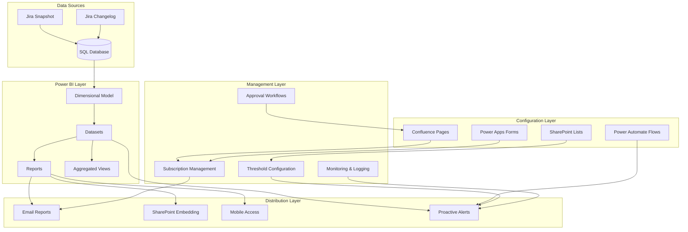
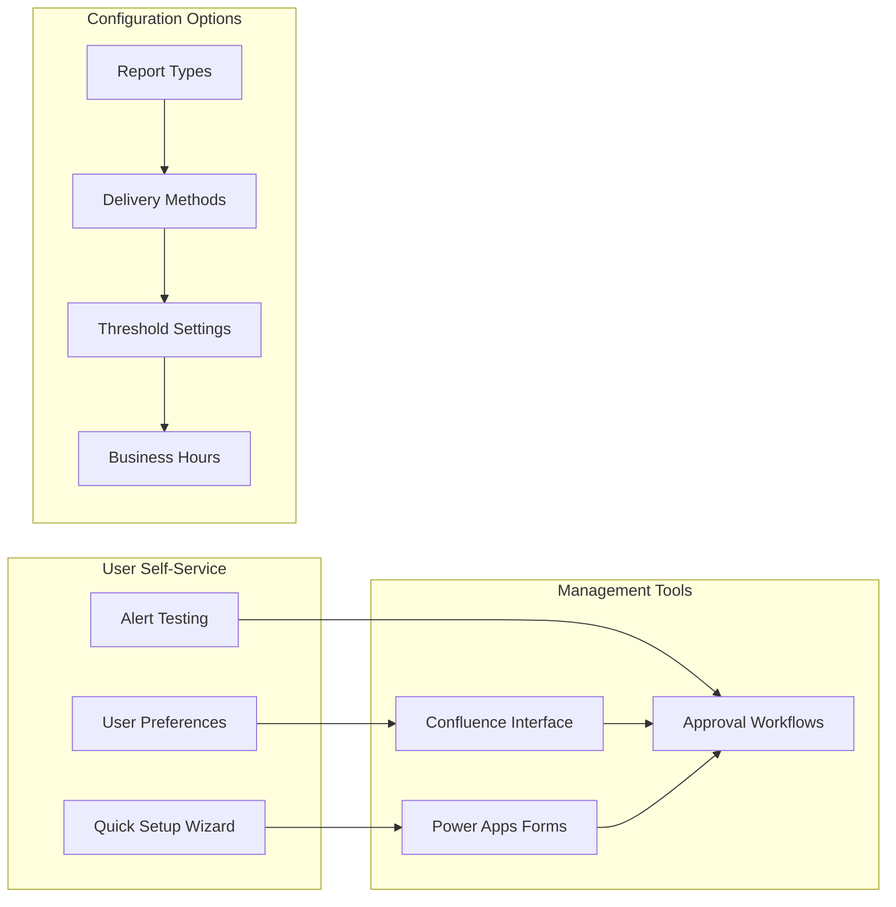
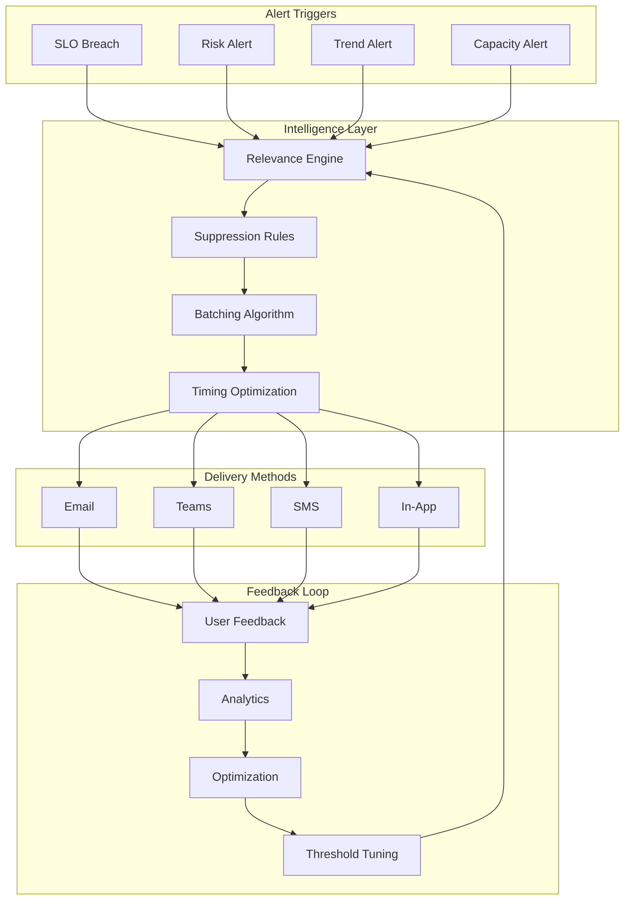

# SLO KPI Dashboard System: Executive Summary

## 1. Executive Overview

The proposed SLO KPI Dashboard System provides a comprehensive, self-service platform for monitoring and managing Service Level Objective performance across all data capabilities. Built entirely on Microsoft Power Platform and Office 365, the solution requires no custom development while delivering enterprise-grade monitoring, alerting, and reporting capabilities.

### Key Value Proposition
- **Zero Development**: 100% no-code solution using Power BI, Power Automate, and SharePoint
- **Self-Service**: Business users manage their own alert preferences and dashboard configurations
- **Scalable**: Designed to grow from 5 capabilities to organization-wide adoption
- **Intelligent**: Smart alerting prevents notification fatigue while ensuring critical issues are detected
- **Compliant**: Built-in audit trails and monitoring for governance requirements

---

## 2. System Architecture Overview

---

## 3. Component Overview

### 3.1 KPI Report Publishing

Configuration Synchronization: Real-time reflection of Confluence changes in published reports through automated nightly sync process

| **Component** | **Description** | **Capability** |
|---------------|-----------------|----------------|
| **Monthly Reports** | Automated generation and distribution | • Capability-specific performance • Executive summaries • Historical trending • Action recommendations |
| **Real-time Dashboards** | Live interactive dashboards | • Current SLO status • Trend analysis • Drill-down capabilities • Mobile optimization |
| **Scheduled Distribution** | Automated delivery on 1st business day | • Role-based content • PDF + interactive versions • Stakeholder-specific views |

### 3.2 Subscription Management

**Key Features:**
- **One-Click Setup**: Role-based templates (Executive, Capability Owner, Team Member)
- **Self-Service Interface**: Confluence-based configuration with visual guides
- **Smart Recommendations**: AI-driven suggestions based on role and historical usage
- **Approval Workflows**: Automated routing for threshold changes requiring approval

### 3.3 Dashboard Embedding Strategy

| **Embedding Location** | **Purpose** | **Access Level** |
|------------------------|-------------|------------------|
| **Corporate Intranet** | Executive overview | Organization-wide visibility |
| **Capability Team Sites** | Detailed operational dashboards | Team-specific data |
| **Personal My Sites** | Individual performance views | User-filtered content |
| **Mobile Apps** | On-the-go access | Responsive design |

**Technical Implementation:**
- Native Power BI web parts in SharePoint
- Row-level security for data access control
- Responsive design for all devices
- Contextual filtering based on user roles

### 3.4 Proactive Alert System

**Anti-Fatigue Features:**
- **Intelligent Suppression**: Prevents duplicate and low-value alerts
- **Smart Batching**: Groups related alerts into digestible summaries
- **Dynamic Thresholds**: Self-adjusting based on user behavior and response rates
- **Contextual Timing**: Delivers alerts when users are most likely to act

---

## 4. Key Benefits

### 4.1 For Executive Leadership
- **Strategic Visibility**: Real-time view of organizational SLO performance
- **Trend Analysis**: 6-month historical trends with predictive insights
- **Cross-Capability Benchmarking**: Compare performance across teams
- **Executive Summaries**: Concise monthly reports with action recommendations

### 4.2 For Capability Owners
- **Operational Control**: Detailed service-level performance metrics
- **Proactive Alerts**: Early warning system for potential SLO breaches
- **Team Management**: Configure alerts and reports for team members
- **Process Insights**: Bottleneck identification and optimization opportunities

### 4.3 For IT Operations
- **Zero Maintenance**: No custom code to maintain or update
- **Self-Service**: Business users manage their own configurations
- **Scalable Architecture**: Easily add new capabilities and services
- **Built-in Monitoring**: Comprehensive logging and alerting for system health

### 4.4 For End Users
- **Personalized Experience**: Customizable alerts and dashboard views
- **Mobile Access**: Full functionality on all devices
- **Intuitive Interface**: Easy-to-use configuration tools
- **Immediate Value**: Get relevant alerts without technical setup

---

## 5. Implementation Approach

### 5.1 Phased Rollout Strategy

| **Phase** | **Duration** | **Scope** | **Key Deliverables** |
|-----------|--------------|-----------|---------------------|
| **Phase 0: Foundation** | 4 weeks | Core dashboard + manual config | • Basic Power BI model • Essential reports • Manual alert setup |
| **Phase 1: Self-Service** | 4 weeks | Subscription management | • Confluence configuration • Power Automate alerts • SharePoint embedding |
 Configuration Sync Monitoring: Implement proactive monitoring of Confluence-to-Power BI synchronization with automated failover and recovery
| **Phase 2: Intelligence** | 4 weeks | Smart features | • Dynamic thresholds • Alert suppression • Predictive insights |
| **Phase 3: Scale** | 4 weeks | Org-wide rollout | • All capabilities onboarded • Training completed • Optimization active |

### 5.2 Success Criteria

**Technical Metrics:**
- 99.5% dashboard availability
- <2 second report load times
- 95% alert delivery success rate
- <10% false positive alert rate

**Business Metrics:**
- 90% user adoption within 3 months
- 50% reduction in SLO-related escalations
- 30% improvement in SLO achievement rates
- 85% user satisfaction scores

**Operational Metrics:**
- 100% capabilities using standardized SLO tracking
- <4 hours monthly system administration required
- Zero compliance audit findings
- 100% audit trail completeness

---

## 6. Risk Mitigation

### 6.1 Technical Risks
| **Risk** | **Mitigation** | **Owner** |
|----------|----------------|-----------|
| Power BI capacity limits | Premium capacity monitoring + auto-scaling | IT Team |
| Alert fatigue | Intelligent suppression + user feedback loops | Business Teams |
| Configuration errors | Validation rules + approval workflows | Capability Owners |
| Data quality issues | Automated validation + data profiling | Data Team |

### 6.2 Change Management
- **Executive Sponsorship**: Clear leadership support and communication
- **Champion Network**: Capability owners as implementation advocates
- **Training Program**: Comprehensive learning paths for all user types
- **Support Structure**: Multiple channels for help and assistance

---

## 7. Resource Requirements

### 7.1 Technical Resources
- **Power BI Premium Capacity**: Existing capacity sufficient for pilot, may need expansion
- **SharePoint Sites**: 6 new team sites for capability management
- **Confluence**: Existing instance with additional page templates
- **Power Automate**: Included in Microsoft 365 licensing

### 7.2 Human Resources
- **Project Manager** (1 FTE x 16 weeks): Overall program coordination
- **Power BI Developer** (1 FTE x 8 weeks): Dashboard development and optimization
- **Business Analyst** (0.5 FTE x 16 weeks): Requirements and testing
- **Change Management** (0.5 FTE x 12 weeks): Training and adoption support

---

## 8. Conclusion

The proposed SLO KPI Dashboard System delivers a comprehensive, scalable solution for organizational SLO monitoring without requiring any custom development. By leveraging existing Microsoft 365 and Power Platform investments, the organization gains:

- **Immediate Value**: Quick time-to-value with proven Microsoft technologies
- **Future-Proof Design**: Scalable architecture ready for organizational growth
- **User Empowerment**: Self-service capabilities reduce IT dependency
- **Operational Excellence**: Proactive monitoring prevents issues before they impact business

**Recommendation**: Proceed with implementation using the phased approach, starting with the Data Quality capability as a pilot to validate the approach before organization-wide rollout.

---

*This solution positions the organization as a leader in data operations maturity while maintaining cost efficiency and operational simplicity through strategic use of existing technology investments.*