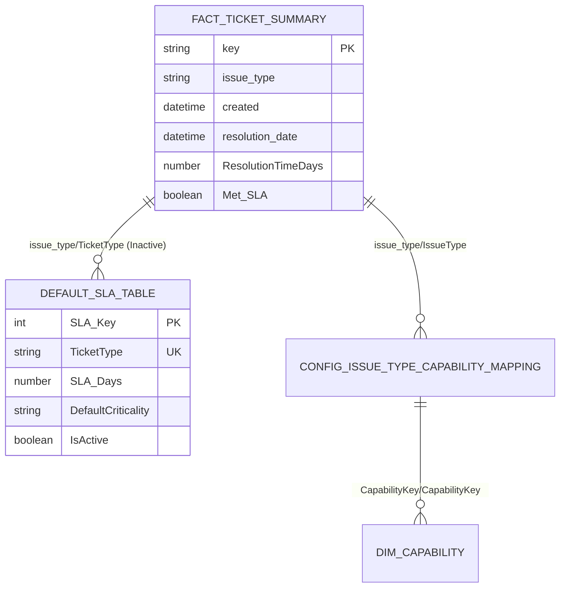

# SLO Dashboard Enhancement: Default SLA Table and Calculated Columns

## Executive Summary

This document outlines the implementation of enhanced SLA tracking capabilities for the Power BI SLO Dashboard through the addition of the `Default_SLA_Table` dimension and two critical calculated columns: `ResolutionTimeDays` and `Met_SLA`. These enhancements provide robust fallback SLA management, accurate resolution time tracking, and comprehensive SLA achievement analysis.

---

## Table of Contents

1. [Default_SLA_Table Overview](#default_sla_table-overview)
2. [Dimensional Model Integration](#dimensional-model-integration)
3. [Power Query Implementation](#power-query-implementation)
4. [Calculated Columns](#calculated-columns)
5. [DAX Measures and Analysis](#dax-measures-and-analysis)
6. [Best Practices](#best-practices)
7. [Implementation Roadmap](#implementation-roadmap)

---

## Default_SLA_Table Overview

### Purpose and Benefits

The `Default_SLA_Table` serves as a **fallback configuration table** that ensures every ticket has an SLA target, supporting:

- **Graceful Degradation**: Prevents null SLA targets during partial configurations
- **Quick Start**: New capabilities can begin tracking immediately with standard defaults  
- **Organizational Consistency**: Establishes uniform baselines across all ticket types
- **Easy Migration**: Smooth transition from defaults to custom capability-specific targets

### Table Schema

```sql
Field Name          | Data Type | Purpose
--------------------|-----------|------------------
SLA_Key             | Int64     | Surrogate key
TicketType          | Text      | Jira issue type (business key)
SLA_Days            | Number    | Default SLA target in days
SLA_Type            | Text      | Type of SLA (Response Time)
DefaultCriticality  | Text      | Standard criticality level
ExcludeWeekends     | Logical   | Exclude weekends flag
BusinessDaysOnly    | Logical   | Business days calculation flag
Notes               | Text      | Business context for SLA
IsActive            | Logical   | Active status
CreatedDate         | Date      | Record creation date
```

### Default SLA Values

| Ticket Type      | SLA Days | Criticality | Business Justification |
|------------------|----------|-------------|------------------------|
| Bug              | 3        | High        | Critical defects require faster response |
| Task             | 5        | Standard    | Standard business day response target |
| Epic             | 10       | Medium      | Large initiatives allow longer response time |
| Story            | 5        | Standard    | User stories standard processing |
| Sub-task         | 2        | Standard    | Sub-tasks inherit parent priority but faster turnaround |
| Improvement      | 7        | Medium      | Enhancement requests standard timeline |
| New Feature      | 15       | Low         | New features require extended analysis time |
| Change Request   | 10       | Medium      | Change management standard process |
| Incident         | 1        | Critical    | Production incidents have highest priority |
| Service Request  | 5        | Standard    | Standard service delivery |

---

## Dimensional Model Integration

### Updated Star Schema

The `Default_SLA_Table` integrates into the existing dimensional model through an **inactive relationship** with the main fact table:



### SLA Resolution Hierarchy

The system employs a **hierarchical fallback** mechanism for SLA target resolution:

1. **Priority 1**: Service-specific SLA overrides (`Dim_Service[ServiceResponseTimeTarget]`)
2. **Priority 2**: Capability-level SLA targets (`Dim_Capability[ResponseTimeTargetDays]`)  
3. **Priority 3**: Default SLA table values (`Default_SLA_Table[SLA_Days]`)
4. **Priority 4**: Ultimate fallback (5 days)

### Relationship Configuration

```javascript
// Inactive relationship used via USERELATIONSHIP in DAX
Model.Relationships.add({
    from: 'Fact_Ticket_Summary[issue_type]',
    to: 'Default_SLA_Table[TicketType]',
    cardinality: 'ManyToOne',
    crossFilterDirection: 'Both',
    isActive: false
});
```

---

## Power Query Implementation

### Option 1: Static Table (Recommended for Phase 0)

```m
// Default_SLA_Table - Static implementation embedded in Power BI
let
    Source = #table(
        {"TicketType", "SLA_Days", "DefaultCriticality", "Notes"},
        {
            {"Bug", 3, "High", "Critical defects require faster response"},
            {"Task", 5, "Standard", "Standard business day response target"},
            {"Epic", 10, "Medium", "Large initiatives allow longer response time"}
            // ... additional rows
        }
    ),
    
    // Add metadata and system columns
    AddMetadata = Table.AddColumn(Source, "SLA_Type", each "Response Time"),
    AddTimestamp = Table.AddColumn(AddMetadata, "CreatedDate", each Date.From(DateTime.LocalNow())),
    AddActive = Table.AddColumn(AddTimestamp, "IsActive", each true),
    AddKey = Table.AddIndexColumn(AddActive, "SLA_Key", 1, 1)
in
    AddKey
```

**Advantages**: No external dependencies, fast refresh, version controlled  
**Use Case**: Development, Phase 0 implementation

### Option 2: SharePoint List (Recommended for Production)

```m
// Default_SLA_Table - From SharePoint List with collaborative editing
let
    Source = SharePoint.Tables("https://company.sharepoint.com/sites/DataTeam"),
    SLA_List = Source{[Name="Default_SLA_Configuration"]}[Items],
    
    // Handle SharePoint column formatting
    RenameColumns = Table.RenameColumns(SLA_List, {
        {"Title", "TicketType"},
        {"SLA_x0020_Days", "SLA_Days"}
    }),
    
    // Data validation and cleaning
    FilterActive = Table.SelectRows(RenameColumns, each [IsActive] = true),
    ValidateData = Table.TransformColumns(FilterActive, {
        {"SLA_Days", each try Number.From(_) otherwise 5}
    })
in
    ValidateData
```

**Advantages**: Collaborative editing, version history, access control  
**Use Case**: Production environment, business user ownership

### Option 3: Hybrid Approach with Fallback

```m
// Default_SLA_Table - Multiple source fallback for maximum reliability
let
    // Define source priority order
    LoadedData = List.First(
        List.RemoveNulls({
            TryLoadDatabase(),
            TryLoadSharePoint(), 
            TryLoadExcel(),
            GetStaticFallback()
        })
    ),
    
    // Standardize regardless of source
    StandardizedData = Table.RenameColumns(LoadedData, {
        {"Title", "TicketType"}
    }, MissingField.Ignore)
in
    StandardizedData
```

**Advantages**: Maximum reliability, graceful degradation  
**Use Case**: Enterprise production, mission-critical scenarios

---

## Calculated Columns

### 1. ResolutionTimeDays

**Purpose**: Calculates the difference in days between ticket creation and resolution.

```dax
ResolutionTimeDays = 
VAR CreatedDate = Fact_Ticket_Summary[created]
VAR ResolvedDate = Fact_Ticket_Summary[resolution_date]

// Handle both resolved and open tickets
VAR CalculationResult = 
    DATEDIFF(
        CreatedDate,
        COALESCE(ResolvedDate, NOW()),
        DAY
    )

RETURN MAX(CalculationResult, 0)  // Ensure non-negative values
```

**Features**:
- Handles unresolved tickets using current date
- Supports both calendar and business day calculations
- Provides foundation for all SLA timing analysis
- Enables trend analysis and performance benchmarking

**Supporting Columns**:
```dax
// Business days version
ResolutionTimeBusinessDays = 
SUMX(
    DATESBETWEEN(Dim_Date[Date], [CreatedDate], [ResolvedDate]),
    IF(Dim_Date[IsBusinessDay] = TRUE, 1, 0)
)

// Progress percentage toward SLA
SLA_Progress_Percentage = 
VAR SLATarget = RELATED(Default_SLA_Table[SLA_Days])
VAR ActualDays = [ResolutionTimeDays]
RETURN 
    IF(SLATarget > 0, MIN((ActualDays / SLATarget) * 100, 200), 100)
```

### 2. Met_SLA

**Purpose**: Determines if each ticket met its SLA target using the hierarchical fallback system.

```dax
Met_SLA = 
VAR ActualResolutionDays = Fact_Ticket_Summary[ResolutionTimeDays]
VAR IsResolved = Fact_Ticket_Summary[resolution_date] <> BLANK()

// Get SLA target using hierarchical fallback
VAR SLA_Target = 
    COALESCE(
        // Priority 1: Capability-level SLA
        CALCULATE(
            RELATED(Dim_Capability[ResponseTimeTargetDays]),
            USERELATIONSHIP(
                Fact_Ticket_Summary[issue_type], 
                Config_Issue_Type_Capability_Mapping[IssueType]
            )
        ),
        
        // Priority 2: Default SLA fallback
        CALCULATE(
            MAX(Default_SLA_Table[SLA_Days]),
            USERELATIONSHIP(Fact_Ticket_Summary[issue_type], Default_SLA_Table[TicketType])
        ),
        
        // Priority 3: Ultimate fallback
        5
    )

// Return TRUE/FALSE/BLANK based on conditions
RETURN 
    SWITCH(
        TRUE(),
        NOT IsResolved, BLANK(),  // Cannot determine yet
        ActualResolutionDays <= SLA_Target, TRUE(),
        ActualResolutionDays > SLA_Target, FALSE()
    )
```

**Features**:
- Uses `RELATED()` and `USERELATIONSHIP()` for SLA target lookup
- Handles unresolved tickets appropriately (returns BLANK)
- Supports both default and capability-specific SLA targets
- Enables efficient filtering and aggregation

**Supporting Columns**:
```dax
// Text status for reporting
SLA_Status = 
SWITCH(
    TRUE(),
    [resolution_date] = BLANK() AND [ResolutionTimeDays] > RELATED(Default_SLA_Table[SLA_Days]),
        "Open - SLA Breached",
    [resolution_date] = BLANK(),
        "Open - Within SLA", 
    [Met_SLA] = TRUE,
        "Resolved - SLA Met",
    [Met_SLA] = FALSE,
        "Resolved - SLA Missed",
    "Unknown"
)

// Variance from SLA target
SLA_Variance_Days = 
[ResolutionTimeDays] - 
CALCULATE(
    MAX(Default_SLA_Table[SLA_Days]),
    USERELATIONSHIP(Fact_Ticket_Summary[issue_type], Default_SLA_Table[TicketType])
)
```

---

## DAX Measures and Analysis

### Core SLA Measures

```dax
// Overall SLA Achievement Rate
SLA_Achievement_Rate = 
DIVIDE(
    COUNTROWS(FILTER(Fact_Ticket_Summary, [Met_SLA] = TRUE)),
    COUNTROWS(FILTER(Fact_Ticket_Summary, [Met_SLA] <> BLANK())),
    0
) * 100

// Enhanced SLA Target Resolution with Fallback
SLA_Target_Days = 
VAR ServiceSLA = CALCULATE(
    MAX(Dim_Service[ServiceResponseTimeTarget]),
    Dim_Service[ServiceResponseTimeTarget] <> BLANK()
)
VAR CapabilitySLA = RELATED(Dim_Capability[ResponseTimeTargetDays])
VAR DefaultSLA = CALCULATE(
    MAX(Default_SLA_Table[SLA_Days]),
    USERELATIONSHIP(Fact_Ticket_Summary[issue_type], Default_SLA_Table[TicketType])
)

RETURN COALESCE(ServiceSLA, CapabilitySLA, DefaultSLA, 5)

// Tickets at Risk of SLA Breach
Tickets_At_Risk = 
CALCULATE(
    COUNTROWS(Fact_Ticket_Summary),
    [resolution_date] = BLANK(),
    [ResolutionTimeDays] >= [SLA_Target_Days] * 0.8
)
```

### Advanced Analysis Examples

```dax
// SLA Performance by Capability
Capability_SLA_Summary = 
SUMMARIZE(
    Fact_Ticket_Summary,
    RELATED(Dim_Capability[CapabilityName]),
    "Total_Tickets", COUNTROWS(Fact_Ticket_Summary),
    "SLA_Achievement_%", 
        DIVIDE(
            COUNTROWS(FILTER(Fact_Ticket_Summary, [Met_SLA] = TRUE)),
            COUNTROWS(FILTER(Fact_Ticket_Summary, [Met_SLA] <> BLANK()))
        ) * 100,
    "Avg_Resolution_Days", AVERAGE(Fact_Ticket_Summary[ResolutionTimeDays]),
    "SLA_Target_Days", [SLA_Target_Days]
)

// Monthly SLA Trend
Monthly_SLA_Trend = 
SUMMARIZE(
    ADDCOLUMNS(
        FILTER(Fact_Ticket_Summary, [Met_SLA] <> BLANK()),
        "ResolvedMonth", FORMAT([resolution_date], "YYYY-MM")
    ),
    [ResolvedMonth],
    "SLA_Achievement_%", 
        DIVIDE(
            COUNTROWS(FILTER(Fact_Ticket_Summary, [Met_SLA] = TRUE)),
            COUNTROWS(Fact_Ticket_Summary)
        ) * 100,
    "Total_Resolved", COUNTROWS(Fact_Ticket_Summary)
)

// Resolution Time Percentiles
Resolution_Percentiles = 
ROW(
    "P50_Days", PERCENTILE.EXC(Fact_Ticket_Summary[ResolutionTimeDays], 0.5),
    "P90_Days", PERCENTILE.EXC(Fact_Ticket_Summary[ResolutionTimeDays], 0.9),
    "P95_Days", PERCENTILE.EXC(Fact_Ticket_Summary[ResolutionTimeDays], 0.95)
)
```

---

## Best Practices

### Data Source Management

1. **Source Selection by Phase**:
   - **Phase 0**: Static table (embedded)
   - **Phase 1**: Excel file with manual updates
   - **Phase 2**: SharePoint List with collaborative editing
   - **Phase 3+**: Database or hybrid approach

2. **Refresh Strategy**:
   - Use incremental refresh for large datasets
   - Implement change detection for optimization
   - Schedule refreshes during off-peak hours
   - Maintain fallback options for reliability

### Error Handling

1. **Comprehensive Validation**:
   ```m
   // Validate SLA values are reasonable
   ValidateData = Table.SelectRows(Source, each
       [SLA_Days] > 0 and [SLA_Days] <= 365
   )
   ```

2. **Graceful Degradation**:
   ```dax
   // Always provide fallback values
   SLA_Target = COALESCE(SpecificSLA, DefaultSLA, 5)
   ```

3. **Audit Logging**:
   ```m
   // Track data source and load timestamps
   AddAudit = Table.AddColumn(Data, "LoadTimestamp", each DateTime.LocalNow())
   ```

### Performance Optimization

1. **Calculated Columns vs Measures**:
   - Use calculated columns for: `ResolutionTimeDays`, `Met_SLA`
   - Use measures for: Aggregations, percentages, trends

2. **Relationship Management**:
   - Keep Default_SLA_Table relationship inactive
   - Use `USERELATIONSHIP()` in DAX when needed
   - Minimize cross-filter directions

3. **Data Types**:
   - Use appropriate types (Int64 vs Decimal)
   - Optimize for VertiPaq compression
   - Remove unnecessary columns

---

## Implementation Roadmap

### Phase 0: Foundation (Weeks 1-4)
- [x] Create Default_SLA_Table with static data
- [x] Implement ResolutionTimeDays calculated column
- [x] Implement Met_SLA calculated column
- [x] Create basic SLA achievement measures
- [x] Validate calculations with pilot data

### Phase 1: External Configuration (Weeks 5-8)
- [ ] Implement SharePoint List data source
- [ ] Add change detection and validation
- [ ] Create business user documentation
- [ ] Establish refresh schedules

### Phase 2: Advanced Analytics (Weeks 9-12)
- [ ] Implement business day calculations
- [ ] Add predictive SLA breach alerts
- [ ] Create advanced dashboards
- [ ] Integrate with capability management

### Phase 3: Enterprise Scaling (Weeks 13-16)
- [ ] Implement hybrid data source approach
- [ ] Add comprehensive audit logging
- [ ] Create self-service configuration interface
- [ ] Establish organizational governance

---

## Conclusion

The implementation of `Default_SLA_Table`, `ResolutionTimeDays`, and `Met_SLA` provides a robust foundation for SLA tracking and analysis. Key benefits include:

- **Universal Coverage**: Every ticket gets an SLA target
- **Flexible Configuration**: Multiple data source options
- **Comprehensive Analysis**: Rich calculated columns for detailed insights
- **Scalable Architecture**: Supports organizational growth
- **Graceful Degradation**: Maintains functionality during partial configurations

This enhancement transforms the SLO dashboard from basic reporting to a comprehensive SLA management platform, supporting both operational monitoring and strategic decision-making across all organizational capabilities.

---

## Appendix: Quick Reference

### Key DAX Functions Used
- `RELATED()`: Access related table values
- `USERELATIONSHIP()`: Activate inactive relationships
- `COALESCE()`: Handle null values with fallbacks
- `DATEDIFF()`: Calculate time differences
- `SWITCH()`: Multi-condition logic
- `FILTER()`: Conditional row selection

### Critical Relationships
- `Fact_Ticket_Summary[issue_type] → Default_SLA_Table[TicketType]` (Inactive)
- `Fact_Ticket_Summary[issue_type] → Config_Issue_Type_Capability_Mapping[IssueType]` (Active)
- `Config_Issue_Type_Capability_Mapping[CapabilityKey] → Dim_Capability[CapabilityKey]` (Active)

### Performance Tips
1. Use calculated columns for frequently accessed calculations
2. Keep relationships simple and well-defined
3. Implement proper data validation at load time
4. Monitor refresh performance and optimize as needed
5. Use appropriate data types for optimal compression